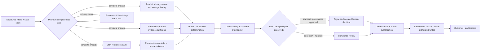

# Exercise 2 — Engagement Design

**Status:** Complete draft for Charles's review  
**Depends on:** `01-diagnosis.md`  
**Scope discipline:** no Echo, no Chiron, no new platform licences, and no enterprise-wide AI platform.

## Working baseline carried from Exercise 1

**FACT FROM SCENARIO**

- Average credentialing elapsed time: **34 calendar days**.
- P90 elapsed time: **41 calendar days**.
- Active working time: **770 minutes / 12.83 hours**.
- Primary flow efficiency: **1.57%**.
- Contractual commitment: **30 days**; approximately **40%** miss it.
- Largest waits: references **11 days**, committee queue **7 days**, primary-source verification queue **5 days**.

**WORKING DIAGNOSIS**

- Reference outreach is the largest observed delay, but causal dominance by case segment is not proven.
- Committee cadence is the clearest large, internally controllable queue.
- The deeper operating problem is the absence of one enforced end-to-end workflow and minimum case record.
- The 11 verification specialists' tacit knowledge is critical infrastructure to externalize with them, not a workforce defect to automate away.

---

# 2a — Outcome

## Metric choice

### Primary business outcome

**Primary metric: percentage of in-scope provider credentialing cases completed within the contractual 30-calendar-day SLA.**

This is preferable to average elapsed time as the primary metric because an average can improve while a large tail still breaches Meridian's contractual commitment. It is preferable to P90 as the primary metric for a 90-day engagement because P90 is statistically unstable in a small pilot and sensitive to low volume. SLA attainment directly expresses the obligation that creates penalties and provider-loss risk.

The other measures remain diagnostics:

- **Average elapsed time:** shows broad movement but can hide the tail.
- **P90 elapsed time:** shows whether the worst routine cases improve, but requires adequate cohort size.
- **Active touch time:** distinguishes labor savings from actual cycle-time improvement.

No adoption, prompt count, model accuracy, or agent-usage measure is a substitute for this business outcome.

## Baseline

- **Scenario baseline:** approximately **60% completed within 30 days**, inferred from “approximately 40% miss target.”
- **Diagnostic baselines:** average **34 days** and P90 **41 days**.
- Because “approximately 40%” is not a validated source-system result, the baseline remains approximate until discovery.

## Baseline verification

During Days 1–10, construct a case-level baseline from the most recent complete pre-intervention arrival cohort, preferably at least 90 days of arrivals if volume supports it. Use:

1. intake receipt/log timestamps;
2. ServiceNow case and milestone events;
3. the verification spreadsheet's operational timestamps/statuses;
4. committee decision records;
5. contracting/countersign records; and
6. the first reliable final-enablement timestamp across the four systems.

Records will be joined using the provider credentialing case ID; where that ID is missing or inconsistent, retain a reconciliation table rather than silently fuzzy-matching providers. Sample cases will be manually traced with Intake, Verification, Credentialing, Contracting, and Operations. Report missingness and disagreement by source. Do not certify ServiceNow as authoritative merely because it is the intended workflow tool.

**Baseline acceptance gate:** Diane, the credentialing process owner, Compliance, and the measurement owner approve the clock definition, denominator, exclusion rules, source precedence, and data-quality limitations before an intervention result is reported.

## Proposed engagement target

> **PROPOSED ENGAGEMENT TARGET:** At least **75% of eligible pilot-cohort cases complete within 30 calendar days**—reducing the miss rate from approximately 40% to no more than 25%—for applications received during Days 31–60 and observed through each case's Day-30 deadline.

This is a proposed target, not a Meridian commitment or a forecast. It is a deliberately material but not falsely precise 15-percentage-point improvement. It must be revisited if the verified baseline, pilot volume, case mix, or contractual clock differs materially from the scenario.

### Target date and measurement window

- **Pilot arrival cohort:** applications received from Day 31 through Day 60.
- **Primary Day-90 readout:** whether each case completed by its own 30-day deadline. A case not completed by that deadline is an SLA miss even if final completion occurs later.
- **Diagnostic follow-up:** calculate final average and P90 once the cohort has fully matured, preferably through Day 105 or at least 45 days after the last cohort entry. This follow-up does not change the Day-90 SLA result.

## Reproducible measurement method

For each included case:

```text
clock_start = authoritative application-received timestamp
clock_end   = authoritative all-required-enablement-complete timestamp
elapsed_calendar_days = (clock_end - clock_start) / 24 hours
sla_met = elapsed_calendar_days <= 30.000 days

SLA attainment = count(sla_met) / count(included cases) × 100
```

Implementation rules:

1. Freeze a versioned cohort manifest containing case IDs, inclusion/exclusion reason, clock start, deadline, and segment fields.
2. Derive milestones from immutable or append-only events rather than editable “current status” alone.
3. Use one documented timezone and normalize daylight-saving behavior.
4. Keep the original timestamp, source system, ingestion time, and any correction event.
5. Publish numerator, denominator, missing-data count, case-mix distribution, and confidence interval; do not publish a percentage without its denominator.
6. Report results by provider type, insurer/network, jurisdiction, risk/exception category, and completeness-at-entry when volume permits. Small groups are suppressed according to Meridian privacy policy.
7. Compare the pilot with the validated historical baseline and, if a genuinely comparable non-pilot cohort exists, show it separately; do not claim randomization or causality from a convenience comparison.

## Cohort inclusion and exclusion

### Include

- All real provider applications in the predeclared pilot slice received during the cohort window.
- Both standard and exception cases in that slice; exceptions are tagged, not removed to improve the result.
- Incomplete-at-entry cases unless the contract explicitly defines a different clock start.
- Cases that miss the SLA, remain open, or require rework.

### Exclude, with reason recorded before outcome review

- Test/training records.
- Exact duplicate records representing the same application; retain one canonical case and the duplicate-resolution audit trail.
- Applications definitively withdrawn by the provider before a credentialing decision; report withdrawals separately with elapsed time and reason.
- Cases outside the predeclared insurer/network, provider class, jurisdiction, or pilot start dates.

Do **not** exclude hard cases, adverse findings, missing references, internal delays, or cases transferred between teams. Any post hoc exclusion is shown in a sensitivity analysis and cannot improve the primary result silently.

## Clock pauses

**UNRESOLVED CONTRACT QUESTION:** The scenario does not say whether the contractual clock pauses for provider-caused delays, force majeure, or formally requested holds.

Until contract review resolves this:

- Primary operational reporting uses an **unpaused calendar clock** from receipt through enablement.
- If the contract permits specific pauses, report a second **contract-adjusted SLA measure** with each pause event, reason code, start/end, approving human, and supporting evidence.
- Automated actors cannot create or approve a clock pause.
- Internal queues, unavailable staff, committee scheduling, system downtime, and failed outreach are not pauses unless the actual contract explicitly says so.

## Falsification criterion

The claim “the engagement improved SLA performance” is **falsified or not established** if any of the following occurs:

1. fewer than 75% of the predeclared, matured pilot cohort meet 30 days;
2. the result depends on post hoc exclusions, undocumented pauses, or changed clock definitions;
3. cohort size or timestamp completeness is insufficient to support the claim;
4. improvement disappears after a predeclared case-mix sensitivity check and no plausible operational explanation is evidenced; or
5. the quality/compliance guardrail breaches the pre-agreed non-inferiority boundary.

A reduction in touch time, positive user feedback, high model accuracy, or increased usage does not override these conditions.

## Secondary guardrail

**Guardrail: material verification defects per 100 completed credentialing cases.**

A material verification defect is a missing, incorrect, expired, mismatched, or unresolved item of required verification evidence discovered through independent QA, audit, committee review, or post-credentialing correction that requires reopening/correction or could alter the decision. Severity and discovery stage are reported separately.

> **BASELINE TO ESTABLISH DURING DISCOVERY**

A numeric target is not invented. Before pilot activation, Compliance and credentialing leadership will approve:

- the defect definition and severity levels;
- independent sampling/review method;
- the historical baseline and its confidence limits;
- a non-inferiority boundary; and
- mandatory reporting of any incorrectly approved case or serious compliance event, regardless of rate.

This guardrail matters because faster processing is not success if Meridian approves a provider on incomplete or incorrect evidence, creates more rework, or makes later audit reconstruction impossible.

---

# 2b — Scope: first 90 days

## Pilot slice

**DESIGN HYPOTHESIS TO VALIDATE:** Select one insurer/network, one jurisdiction, and one sufficiently common provider class with meaningful volume, representative workflow, and no uniquely high-risk exception regime. Selection occurs during Days 1–3 using volume, case-mix, compliance, and sponsorship data—not convenience alone.

## In scope

1. A bounded provider-credentialing pilot cohort.
2. One minimum case record and append-only milestone/event history.
3. Automatic elapsed-time and queue-age measurement.
4. Reference-outreach instrumentation, approved templates, timed reminders, escalation, and human takeover.
5. Earlier initiation and safe parallelization of eligible checks.
6. Human-reviewed evidence collection/normalization for primary-source and malpractice work.
7. A curated first credentialing corpus, not enterprise search.
8. Continuous draft committee-packet preparation with citations.
9. A governance proposal and, only if approved, a bounded committee-cadence or low-risk decision-path experiment.
10. Case-level traceability, cost/usage attribution, Security review, and runbooks.
11. Documentation of verification decision rules, examples, counterexamples, and exceptions with the 11 specialists.

## Explicitly out of scope

| Exclusion | Why excluded in the first 90 days |
|---|---|
| Cleaning or indexing all 400,000 SharePoint files | Expands scope without proving credentialing value; increases stale/conflicting-content and permission risk. |
| Replacing the mainframe | Not necessary to test credentialing flow; creates disproportionate technical and operational risk. |
| Rebuilding ServiceNow | The goal is a minimum enforceable record and event spine using existing capabilities, not platform replacement. |
| Solving all Meridian AI governance | Define controls for this workflow and produce reusable patterns; enterprise governance is a separate mandate. |
| Eliminating enterprise technical debt | Address only debt that directly blocks the bounded workflow, observability, identity, or supportability. |
| Automating final primary-source determinations | Evidence gathering can be assisted; compliance-significant judgment remains human unless policy and law explicitly allow otherwise. |
| Automating committee decisions | Decision support is in scope; autonomous approval is not. |
| Autonomous contract countersignature | Legal commitment remains with authorized humans. |
| Autonomous writes to all four enablement systems | High blast radius and hard reconciliation; first 90 days prepare tasks/checklists and require human authorization. |
| Broad enterprise chatbot or AI platform | Repeats the prior solution-first pattern and conflicts with no-new-licence constraints. |
| Echo or Chiron | Explicitly prohibited for this engagement. |
| New platform licences | Explicit fiscal constraint; every dependent Azure capability requires entitlement verification. |

These exclusions preserve a measurable causal path, reduce Security review surface, and prevent workflow redesign from becoming a disguised platform transformation.

## First shipment in Days 1–14

**First real shipment:** a **structured minimum credentialing case record plus append-only workflow/reference event ledger for the pilot slice**, implemented in existing ServiceNow capabilities if the Day-5 feasibility check confirms enforceable fields, ACLs, and team adoption.

It includes required pilot fields, a case ID, clock start/deadline, milestone timestamps, owner, wait reason, reference attempts/responses, exception flags, next action, and an automatically calculated case/queue age. Existing source fields are reused or auto-populated where possible; the verification team does not duplicate data entry into a third record.

Why this is the best first shipment:

- it changes actual daily work and handoffs rather than demonstrating a chatbot;
- it creates the evidence needed to determine where time is really lost;
- it is low regulatory consequence because it initially records and routes work rather than making decisions;
- it is reversible through a pilot scope/feature flag and exportable event log;
- it becomes the accountability spine for later retrieval, outreach, recommendations, approvals, and outcome measurement; and
- it tests the uncomfortable organizational issue: whether Meridian can enforce one minimum case record.

**Day-14 stop condition:** if ServiceNow cannot support an enforceable pilot record without rebuilding or unlicensed modules, do not create a permanent shadow workflow. Run a time-limited measurement ledger using an already approved Azure storage capability **only if available and approved**, and ask Diane to choose between fixing the ServiceNow minimum path or narrowing/stopping the production pilot.

## 90-day engagement shape

| Period | Outcome | Artifact / system change | Evidence collected | People required | Decision gate |
|---|---|---|---|---|---|
| **Days 1–14** | Establish trustworthy baseline and make real pilot cases observable | Minimum case record; append-only milestone/reference events; cohort definition; clock rules; data-quality report; initial runbook | Source agreement/missingness, queue ages, reference attempts, case walkthroughs, user burden, ServiceNow feasibility | Diane/delegate, process owner, 2–3 verification specialists, Intake, Credentialing, ServiceNow owner, data analyst, Compliance, Security, Engineering | **Gate 1:** approve metric, cohort, system-of-record path, Security constraints, and whether data capture replaces rather than adds work |
| **Days 15–30** | Reduce reconstruction and prepare safe interventions | Curated credentialing corpus; metadata/provenance; read-only retrieval; reference templates/escalation rules; first exception taxonomy; shadow-mode evidence recommendations and packet drafts | Retrieval relevance/citation review, false/missing evidence, manual vs assisted prep time, outreach baseline response curves, override reasons | Verification specialists, Compliance, credentialing analyst, SharePoint owner, Security, Engineering | **Gate 2:** corpus ownership/freshness accepted; shadow outputs meet quality threshold; approved outreach channels/templates; no production model access to provider data without residency approval |
| **Days 31–60** | Operate redesigned pilot for eligible cases | Earlier reference initiation; event-driven reminders with human takeover; parallel eligible checks; draft evidence records; continuously assembled committee pre-read; human approvals captured | SLA trajectories, time-to-first-reference response, queue-age distribution, defect guardrail, overrides, response rate by channel, token/cost if models used | Pilot team, designated verification rule owners, Intake, committee coordinator, Compliance, Security/Engineering support | **Gate 3:** continue, modify, or stop each intervention independently; any outreach degradation or guardrail breach triggers rollback/human-only path |
| **Days 61–90** | Test sustainable operating model and produce defensible outcome | Approved committee-cadence/fast-lane experiment if governance permits; hardened runbooks, ownership, revoke procedures, support model, outcome dashboard | Mature SLA result, defect guardrail, adoption burden, queue changes, audit replay, cost per completed case, non-pilot comparison if valid | Diane, committee leadership/physicians, process owner, Verification, Compliance, Security, VP Engineering, Operations | **Gate 4:** scale, extend, retain only instrumentation, or stop; no scale without accountable owner, quality evidence, security approval, and support capacity |

---

# 2c — Workflow redesign

## Version A — “Driveshaft”: accelerate work, preserve the process shape

This version assists completeness checking, evidence collection, malpractice review preparation, outreach drafting, committee packet preparation, contract preparation, and enablement checklists, but leaves all waits, sequence, committee cadence, and decision rights unchanged.

### Quantitative effect

Baseline:

```text
Elapsed time = 34 calendar days = 816 hours
Active work  = 770 minutes = 12.833 hours = 0.5347 calendar day
```

Assume, generously, that every minute saved lies on the critical path and translates one-for-one into elapsed-time reduction. That is the **maximum** effect when queues remain unchanged.

| Active-work reduction | Minutes saved | Hours saved | Calendar days saved | New elapsed time | Reduction in 34-day elapsed time |
|---:|---:|---:|---:|---:|---:|
| **25%** | 192.5 min | 3.208 h | 0.1337 day | **33.8663 days** | **0.39%** |
| **50%** | 385 min | 6.417 h | 0.2674 day | **33.7326 days** | **0.79%** |
| **100% — impossible upper bound** | 770 min | 12.833 h | 0.5347 day | **33.4653 days** | **1.57%** |

> **Visually important contrast:** cutting active work in half does **not** cut a 34-day process to 17 days. It removes at most **6.42 hours**, leaving approximately **33.73 calendar days** if queues and cadence do not change.

Real improvement could be smaller because some assisted work is not on the critical path, saved time may occur during already-overlapping activity, and generated output may add review time. Driveshaft can reduce labor burden and fund redesign capacity, but it is not a credible standalone answer to the SLA problem.

## Version B — redesign the workflow shape

### Current shape


### Proposed shape



The diagram shows candidate paths, not pre-approved policy. Any low-risk, asynchronous, delegated, or exception-only decision path is a **DESIGN HYPOTHESIS — REQUIRES GOVERNANCE / REGULATORY VALIDATION**.

### Changes and assumptions

| Area | Current | Proposed | Expected effect | Assumption / risk |
|---|---|---|---|---|
| Intake | Case logged; completeness waits 1.5 days | Create minimum case record and clock immediately; prompt for missing required fields | Removes reconstruction and makes queue age visible | ServiceNow fields/ACLs can be enforced without burdensome duplicate entry |
| References | Begin late; 11-day average wait | Start once minimum identity/contact prerequisites are met, potentially alongside PSV; record every attempt/response | Overlaps external waiting with internal work | **DESIGN HYPOTHESIS:** policy permits earlier contact and required reference set is known |
| Reference follow-up | “Wait 11 days” as a block | Measure response curve; timed reminders; approved channel choices; threshold escalation; human takeover on nonresponse or degraded channel performance | Converts passive delay into controlled events; may remove 2–4 net days | Contact preferences, consent, channel availability, and message trust must be validated; automation may lower response rate |
| Provider visibility | Missing references/status may require manual inquiry | Show only approved missing-reference status and provider action through an existing approved channel | Reduces avoidable back-and-forth | Existing channel and entitlement must exist; do not expose reference content or adverse details |
| Reference requirement | All cases appear to follow one path | Determine whether policy legally allows waiver/different evidence for defined case classes | Could avoid unnecessary waits | **DESIGN HYPOTHESIS — REQUIRES GOVERNANCE / REGULATORY VALIDATION**; never infer waiver from model output |
| Primary-source verification | Waits 5 days and begins sequentially | Pull eligible work when minimum prerequisites are present; run independent checks in parallel; agent gathers/normalizes/compares | May remove 1–2.5 queue days and reduce touch time | Source availability and staff capacity; human retains regulated determination |
| Malpractice review | Follows PSV sequentially | Gather permitted malpractice evidence in parallel where dependencies allow | Overlaps a 2-day wait with other work | Rules may require a verified identity or preceding check; validate dependencies |
| Committee packet | Prepared after references, then waits 3 days | Build packet continuously from cited evidence; flag missing items rather than reconstruct at end | Reduces packet queue and pre-read churn | Packet format and evidence sufficiency approved by committee/Compliance |
| Committee cadence | 7-day average queue for 15-minute decision | Options: more frequent short sessions, asynchronous voting, delegated standard-case approval, or exception-only committee | Potentially removes 2–5 days | **DESIGN HYPOTHESIS — REQUIRES GOVERNANCE / REGULATORY VALIDATION**; physician availability, bylaws, quorum, and law may constrain it |
| Contract | Waits 2 days after decision | Prepopulate approved template after decision prerequisites; human/legal authorization and countersignature remain | May remove part of handoff delay | Correct template, authority, and decision status must be machine-verifiable |
| Enablement | Sequential work across four systems; 1-day wait | Create synchronized tasks/checklists; human-authorized execution and reconciliation | Reduces lost handoffs and makes partial enablement visible | No autonomous cross-system writes in first 90 days; legacy interfaces may limit automation |
| Exceptions | Often discovered at handoff | Explicit exception taxonomy, owner, due date, evidence, and escalation in minimum case record | Less rework and invisible waiting | Specialists must own taxonomy evolution; too many required fields could create workarounds |

### Parallelization candidates

Subject to policy/dependency validation:

1. References can begin after a minimum completeness gate rather than after malpractice review.
2. Independent primary-source checks can be gathered concurrently rather than as one serial block.
3. Malpractice evidence gathering can overlap with other verification work.
4. Committee packet assembly can occur continuously as evidence arrives.
5. Contract template preparation can begin before committee decision, while execution remains blocked until an authorized decision.
6. Enablement plans/tasks can be staged before countersignature, while system writes remain blocked until contractual authorization.

A dependency matrix created with the specialists will label each prerequisite as legal/regulatory, policy, data, or habit. Only policy/habit dependencies with accountable approval are candidates for removal.

### Improvement estimate

#### Mathematically removable wait

The three largest listed waits total:

```text
11 reference + 7 committee + 5 primary-source queue = 23 calendar days
```

Twenty-three days is a mathematical exposure, **not** a removable forecast. External response time, legally required review, staffing, case complexity, and overlap prevent simply subtracting all 23 days.

#### Reasoned components

- Earlier/event-driven references: **2–4 days** of net elapsed improvement if response curves and channel performance support it.
- Pull/parallel evidence work: **1–2.5 days**.
- Continuous packet and triggered handoffs: **0.5–1.5 days**.
- Committee redesign: **2–5 days**, entirely governance-dependent.
- Active-work assistance: approximately **0.1–0.27 day** at 25–50% touch-time reduction.
- Overlap/double-counting discount: approximately **1–3 days**, because improvements do not add independently.

> **PROPOSED DESIGN RANGE:** approximately **5–10 calendar days** of net average elapsed-time improvement for the validated pilot, implying a directional average of roughly **24–29 days** from a 34-day baseline.

This is a design hypothesis, not a promise. Without committee-path approval, the more defensible range is approximately **3–6 days**, implying roughly **28–31 days**. Case-mix effects and reference response behavior could reduce either range. The 30-day commitment is therefore feasible to test, not guaranteed by arithmetic.

### What this redesign asks of the 11 verification specialists

Their average nine-year tenure makes them the highest-value source of operational truth in the engagement.

1. **Shadowing and walkthroughs:** observe real standard, incomplete, adverse, and ambiguous cases; record what evidence changes a decision and why.
2. **Decision-rule elicitation:** use “if/then/because” interviews tied to actual cases, not generic policy workshops.
3. **Exception taxonomy:** classify missing evidence, source conflict, name/identity mismatch, expiration, jurisdiction variance, adverse history, unreachable reference, and policy ambiguity.
4. **Examples and counterexamples:** for each proposed rule, capture a case that should match, a near miss that should not, and the evidence required to distinguish them.
5. **Recommendation review:** specialists review shadow-mode agent outputs, mark correct/incorrect/incomplete, and supply reason codes; disagreement becomes a rule-review item, not hidden override.
6. **Rule ownership:** nominate rotating verification rule owners who approve corpus/rule changes with Compliance and receive time in workload planning for this responsibility.
7. **Role evolution:** reduce repetitive searching, chasing, copying, and packet reconstruction; increase exception resolution, source-quality judgment, coaching, QA sampling, rule stewardship, and process-improvement authority.
8. **No silent extraction:** transcripts and examples are reviewed by participants before publication; sensitive case material is minimized; attribution follows Meridian policy.

### Uncomfortable adoption paragraph

This redesign asks experienced specialists to expose workarounds and judgment that may have protected both the process and their professional value for years. A request to “document everything you know” can reasonably sound like knowledge extraction before headcount reduction, especially after disappointing AI programs. Leadership must state what workforce decisions are and are not connected to the pilot, give specialists decision rights over rules and stop conditions, allocate paid capacity for redesign, show where their corrections changed the system, and measure removed toil rather than “knowledge captured.” If Meridian cannot make those commitments credibly, resistance is rational and the pilot should not pretend that training will solve it.

---

# 2d — Build the three conditions using the existing estate

## Shared context

### First credentialing corpus only

Do not index all SharePoint content. Establish a permission-scoped **Provider Credentialing — Controlled Corpus** library/site containing only:

- current credentialing SOPs;
- insurer/network-specific rules for the pilot;
- jurisdiction-specific verification requirements;
- reference procedures and approved outreach templates;
- primary-source and malpractice verification rules;
- committee charter/policies and packet requirements;
- escalation procedures;
- approved decision aids/checklists;
- current Compliance guidance; and
- a small set of representative cases/examples, de-identified where possible and otherwise access-restricted.

### Canonical and derived layers

- **Canonical source:** approved documents remain in the controlled SharePoint library with named owners and version history.
- **Derived retrieval layer:** chunks/index records are disposable derivatives, never the source of authority.
- **Index technology:** use an existing Azure-native search entitlement if available; otherwise a buildable index in an already approved Azure compute/storage pattern. **VERIFY EXISTING AZURE ENTITLEMENT.** Do not buy a platform or reuse one of the three retrieval systems without control and quality comparison.

### Ownership

- Business owner: end-to-end credentialing process owner.
- Content owners: named policy/Compliance owners by document type.
- Technical custodian: Engineering/SharePoint owner.
- Rule stewards: designated verification specialists plus Compliance approver.
- Each document must have an owner; “team” alone is not an owner.

### Metadata

Every canonical document and derived chunk carries:

- document ID and immutable version ID;
- title and document type;
- insurer/network;
- jurisdiction;
- provider type/specialty if relevant;
- workflow step;
- effective date and superseded date;
- owner and approver;
- approval status;
- sensitivity classification;
- permitted audience/agent roles;
- source URL/path;
- last reviewed date and next review date; and
- supersedes/is-superseded-by relationship.

### Ingestion and update

1. Owner submits or updates a document in the controlled library.
2. Required metadata and approval are validated.
3. Approved version emits or schedules an ingestion event.
4. Text is extracted/chunked within the approved Azure boundary.
5. Permission and version metadata are copied into the derived index.
6. Retrieval tests and citation resolution run.
7. New index version is activated; previous index version remains auditable for the approved retention period.
8. Deletion/supersession removes the version from active retrieval without erasing historical decision references.

**VERIFY EXISTING AZURE ENTITLEMENT** for eventing, indexing, compute, and monitoring components. A scheduled incremental build is acceptable if event-driven components are not already available.

### Stale-content behavior

- Expired, superseded, unapproved, or review-overdue content is excluded from autonomous recommendation context by default.
- Humans may retrieve a clearly watermarked historical version for audit.
- If no current approved source exists, the assistant returns “no current approved source” and routes to the owner; it must not substitute a semantically similar stale rule.
- Existing decisions retain immutable citations to the exact historical version used.

### Human and agent access

- Humans access canonical documents through SharePoint permissions and retrieval UI embedded in the workflow if existing capabilities permit.
- Automated actors retrieve only content their distinct identity can access; the index must enforce or pre-segment permissions rather than rely on prompt instructions.
- Each answer/recommendation displays document title, version, effective date, owner, and direct citation/passage.
- Raw representative case examples are not made globally searchable.

### Evidence provenance

Every retrieved passage records document ID/version, chunk/passage ID, retrieval timestamp, query or rule trigger, rank/score where applicable, and content hash. The case decision log stores references, not uncontrolled copies, except where records policy requires an immutable evidence snapshot.

## Minimum case record

The record travels with the provider and eliminates handoff reconstruction. Fields are required only where they replace real work or support control; avoid form inflation.

### Identity and scope

- immutable credentialing case ID;
- authoritative provider ID plus source;
- provider name and safe matching attributes;
- application received timestamp/source;
- insurer/network;
- jurisdiction;
- provider type/specialty;
- case/risk path and policy version used;
- current owner/team and workflow state.

### SLA and workflow

- unpaused SLA clock start, deadline, current age;
- contract-adjusted pause events, if legally permitted, with approver/evidence;
- milestone/event history with actor and timestamp;
- current wait reason and wait start;
- required next action, owner, due date, escalation date;
- completeness status and missing-item list;
- duplicate/withdrawal status and reason.

### Verification evidence

- required check list by rule version;
- each check's status;
- source organization/system, source identifier/URL, retrieval timestamp, and evidence version/hash;
- extracted/normalized value and original evidence link;
- mismatch/expiry/adverse flags;
- unresolved exception taxonomy, severity, owner, and disposition;
- human verifier, decision, timestamp, and rationale;
- automated recommendation/execution ID where present.

### References

- reference requirement and governing rule;
- approved contact identity/channel;
- request/attempt timestamps, template/version, sender actor;
- delivery/bounce/response status;
- response evidence and validation status;
- next reminder/escalation/human-takeover date;
- no sensitive free-text content in generic telemetry.

### Decision and downstream state

- packet version and evidence completeness;
- committee/delegated decision path and governing approval;
- human voters/approver, decision, timestamp, conditions, rationale;
- contract template/version, authorization/countersign status;
- four-system enablement tasks, human authorizer, completion/reconciliation state;
- final completion timestamp;
- SLA result, rework/reopen events, QA/audit result, and material defect flag.

## Identity

### Minimum automated actors

The 90-day design uses **three** automated identities. Completeness checks and packet assembly are capabilities of these bounded services, not reasons to create more agents. There is no autonomous committee, contract-signing, or enablement actor.

### Actor 1 — Workflow and timeline orchestrator

| Field | Design |
|---|---|
| Role | Deterministically create/validate minimum case records, calculate clocks/queue age, create bounded tasks/reminders, and append workflow events. No model is required. |
| Trigger | New/updated pilot case or scheduled due-date scan. |
| Read access | Pilot ServiceNow case fields and approved configuration/rule table; no broad SharePoint or Oracle access. |
| Write access | Only named minimum-record fields, task records, timer/escalation fields, and append-only workflow events for pilot cases. |
| Explicitly prohibited | Changing verification evidence, recording final determinations, pausing SLA, approving cases, signing contracts, enabling providers, deleting history, or editing non-pilot cases. |
| Memory | No hidden conversational memory. Durable state is the ServiceNow case/event record; transient processing state is discarded. |
| Approval requirement | Human approval for any clock correction, exception disposition, case closure, or action outside deterministic field validation/task creation. |
| Identity | Azure Managed Identity if hosted on a compatible Azure service; otherwise a dedicated Microsoft Entra service principal. No shared “AI” account. |
| Enforcement | Authentication by Entra; Azure RBAC for hosting resources; ServiceNow OAuth/API identity plus role/ACL restricted to pilot table/fields/actions; network allowlist/private connectivity where supported. **VERIFY EXISTING AZURE ENTITLEMENT.** |
| Logging | Case ID, execution ID, trigger, rules/config version, fields read by category, event/task created, before/after state, result/error, latency, actor identity. No full documents in telemetry. |
| Revocation / kill switch | Disable workload; remove Entra role assignment or disable service principal; revoke ServiceNow OAuth credential/role; disable pilot integration feature flag. |
| Blast radius | Integrity risk limited to pilot workflow fields/tasks. Field-level ACLs, pilot predicate, rate limits, and append-only history prevent broader case decisions or deletion. |

### Actor 2 — Reference outreach actor

| Field | Design |
|---|---|
| Role | Send only approved reference requests/reminders through approved existing channels, record delivery/response events, and route failures to humans. Prefer deterministic templates over generative text. |
| Trigger | Human-approved initial outreach task or pre-approved timed reminder rule on an eligible pilot case. |
| Read access | Case ID, provider display identity, approved reference name/contact/channel, requirement status, attempt history, template ID, due/escalation dates. No clinical/claims data or full verification file. |
| Write access | Approved outbound message endpoint and append-only outreach events/next-action fields in ServiceNow. |
| Explicitly prohibited | Inventing contacts, changing recipients after approval, free-form model-generated outbound text in production, sending attachments not allowlisted, altering verification/decision status, bulk messaging, or deciding that a reference is waived/sufficient. |
| Memory | Outreach state only in the case record; no long-term model memory or private contact list outside source systems. |
| Approval requirement | Initial contact/recipient and template approved under policy; human takeover after configured failures, bounce, negative response, ambiguity, complaint, or response-rate degradation. |
| Identity | Separate managed identity/service principal from the orchestrator, plus the existing approved messaging-system application identity if required. |
| Enforcement | Entra authentication; messaging API scope limited to a dedicated sender and approved template operation where supported; ServiceNow ACL limited to outreach events; recipient/case/template allowlist; per-case/global rate limits; network egress allowlist; secrets in Key Vault only if managed identity cannot be used. **VERIFY EXISTING AZURE ENTITLEMENT and existing messaging interface.** |
| Logging | Case/execution ID, recipient reference ID (masked in general logs), channel, template/version, send/delivery/bounce/response event, approval identity, attempt number, latency, error, human-takeover event. Message body retained only under approved records policy. |
| Revocation / kill switch | Disable sender/integration, remove Entra assignment, revoke messaging credential, set global “manual outreach only” flag, and cancel pending reminders. |
| Blast radius | External communication/reputation and privacy risk. Constrain to pilot cases, one message template set, approved recipients, rate limits, no attachments by default, and immediate manual-only rollback. |

### Actor 3 — Evidence and packet preparation actor

| Field | Design |
|---|---|
| Role | Retrieve approved rules/evidence, extract and normalize values, compare sources, flag mismatch/expiry, and assemble cited draft evidence records and committee packets. It recommends; it does not determine or approve. |
| Trigger | Human request or eligible pilot task after minimum prerequisites are met. |
| Read access | Current approved credentialing corpus; current pilot case; narrowly scoped Oracle read-only view if needed; approved primary-source endpoints through allowlisted connectors; only the provider/case being processed. No mainframe access unless separately justified and approved. |
| Write access | Draft evidence fields, citations, discrepancy flags, and draft packet artifact for the current case. Cannot write final verification or decision fields. |
| Explicitly prohibited | Final primary-source determination, clearing exceptions, altering canonical documents, training on case data, broad provider search/export, committee vote, contract approval, or enablement writes. |
| Memory | Retrieval context exists only for one execution. Durable outputs/citations are stored in the case record; no hidden cross-case memory. Representative examples remain in the controlled corpus under separate permissions. |
| Approval requirement | Human verifier accepts/corrects each compliance-significant evidence item and signs the determination; credentialing analyst approves packet completeness; model access to provider data requires prior Security approval. |
| Identity | Dedicated managed identity where supported or dedicated service principal; separate from outbound messaging and orchestration identities. Human approver retains personal Entra/ServiceNow identity. |
| Enforcement | Entra authentication; Azure RBAC to compute/index/log resources; SharePoint permission to controlled corpus only; Oracle read-only view/grant and row/query constraints where feasible; ServiceNow ACL permits draft fields/artifact only; connector allowlist; network/private endpoint controls where supported; Key Vault for unavoidable non-managed credentials. **VERIFY EXISTING AZURE ENTITLEMENT.** |
| Logging | Case/execution ID, actor identity, model/tool/version, prompt/template hash, evidence document/version/passage IDs, source calls, normalized outputs, discrepancy flags, draft artifact hash, human accept/edit/reject and reason, token/usage/cost, errors/latency. Sensitive content stays in approved record storage, not generic logs. |
| Revocation / kill switch | Stop workload; remove Entra/RBAC assignments; revoke SharePoint permission, Oracle grant, ServiceNow role, connector credentials, and model endpoint access; invalidate active job queue. |
| Blast radius | Confidentiality risk from provider data and integrity risk in draft evidence. Limit to current pilot case, read-only data views, controlled corpus, draft-only writes, output labeling, rate/export limits, and mandatory human determination. |

### Control types are not interchangeable

- **Authentication:** Microsoft Entra ID proves which workload or human is calling.
- **Authorization:** Azure RBAC, SharePoint permissions, ServiceNow roles/ACLs, Oracle grants/views, messaging scopes, and field/action checks determine what that identity may do.
- **Secret storage:** Azure Key Vault protects credentials/certificates only when a managed identity cannot remove the secret; Key Vault does not grant business-system authorization by itself.
- **Network isolation:** private endpoints, firewall rules, allowlists, and controlled egress constrain reachable services; they do not replace identity or field-level authorization.
- **Auditing:** ServiceNow history and approved Azure logs record what occurred; logging does not prevent an unauthorized action.
- **Conditional Access:** apply to human administrative/approval access where appropriate. Do not claim that human Conditional Access policies directly control managed-identity token issuance; workload identity restrictions, RBAC, credential controls, and network policy govern non-human actors.

## Data residency and model data flow

**SECURITY VALIDATION REQUIRED BEFORE MODEL ACCESS TO PROVIDER DATA.**

No production model interaction involving provider PII, regulated evidence, or case narratives occurs until Security approves the endpoint, region, processor terms, retention behavior, abuse-monitoring behavior, logging, encryption, and network path.

| Interaction | Data sent | Provider PII / regulated data? | Processing location requirement | Retention expectation | Logging location | Required confirmation |
|---|---|---|---|---|---|---|
| Policy/rule retrieval for human use | Query plus approved credentialing document chunks | Design to avoid provider PII | Approved Meridian/Azure region; no cross-region fallback | No model training; transient processing; canonical docs remain SharePoint | Approved Azure logs and case retrieval event | Corpus classification, endpoint region, entitlement, vendor retention/abuse-monitoring terms |
| Completeness/routing | Structured field presence, rule IDs, due dates | May include case ID; design can avoid sending names to a model; deterministic rules preferred | Keep in approved tenant/region | No hidden memory; state in ServiceNow | ServiceNow + approved Azure execution logs | Whether any model is needed; if not, prohibit model call |
| Evidence extraction/normalization | Selected evidence document or passage, expected schema, case context | **Yes**, likely provider PII and regulated credentialing data | Only Security-approved in-region/private endpoint or approved local/buildable execution path | Zero/approved transient provider retention; no training; output stored under records policy | Detailed record in ServiceNow/approved evidence store; metadata in Azure logs | **SECURITY VALIDATION REQUIRED BEFORE MODEL ACCESS TO PROVIDER DATA**; data processor, encryption, endpoint, region, retention, subprocessor, failover |
| Committee packet summarization | Verified evidence, exceptions, citations, decision-rule context | **Yes** | Same approved boundary as evidence processing | No cross-case memory or training; packet retained as official record | ServiceNow/approved document store plus metadata logs | Compliance approval, minimum necessary fields, human packet review, model/version approval |
| Reference outreach | Approved template plus minimum merge fields | Contact/provider PII, but no model should be needed | Existing approved messaging region/path | Per communication/records policy | Messaging audit + ServiceNow outreach event | Approved sender, content, channel, recipient data, retention; model-generated outbound text prohibited initially |
| Timer, event, and SLA calculations | Case ID, timestamps, states | Case metadata, no narrative | Existing approved ServiceNow/Azure boundary | Workflow retention policy | ServiceNow and approved Azure logs | No model; deterministic component approval |

All detailed logs and evidence remain in approved Meridian-controlled locations. Generic telemetry receives identifiers and metadata, not full provider documents or prompts. Exact retention periods are not invented: Security, Privacy, Compliance, and Records Management must approve them before production. Audit records must remain queryable beyond the six-month reconstruction horizon.

## Accountability

### Reconstruction chain and systems of record

ServiceNow is the proposed workflow/accountability spine **only if Gate 1 confirms enforceability, field history, ACLs, integration support, and pilot adoption**.

| Link | Record required | Proposed system of record |
|---|---|---|
| Case | Immutable case ID, provider/network/jurisdiction, cohort, clock start/deadline | ServiceNow minimum case record; inbound receipt source retained |
| Workflow event | State transition, wait reason, actor, source/target state, timestamp, next action | Append-only ServiceNow event/history record |
| Context/evidence | Source system, document/evidence ID and version/hash, passage, retrieval timestamp, rule version | Canonical SharePoint/source system; immutable citation/snapshot reference in ServiceNow |
| Automated recommendation | Execution ID, actor identity, model/tool/version, template/prompt hash, input evidence IDs, output, confidence/flags, latency/error | Approved Azure execution log for technical detail; durable recommendation and references in ServiceNow |
| Human decision | Named human identity, role, accept/edit/reject, reason, timestamp, exception disposition | ServiceNow approval/decision log using personal identity |
| Write/action | Calling identity, approved action, before/after state, API/result ID, timestamp | Target-system audit log plus linked ServiceNow workflow event |
| Resulting state | New workflow state, owner, due date, unresolved conditions | ServiceNow case/event record; target systems remain authoritative for their own state |
| Business outcome | completion timestamp, 30-day result, elapsed days, rework/defect/audit outcome, cohort | Versioned measurement dataset derived from signed event sources; summarized in outcome report |

If ServiceNow cannot be made the enforced spine, the Day-14 gate must explicitly choose a remediation/narrowing path. A temporary approved measurement ledger cannot quietly become a fourth permanent workflow system.

### Correlation identifiers

- `credentialing_case_id`: stable across every business and technical event.
- `workflow_event_id`: immutable event identifier.
- `execution_id`: one automated run/tool chain.
- `recommendation_id`: durable recommendation linked to evidence.
- `approval_id`: human decision/approval.
- `target_action_id`: target-system write or message.
- `correlation_id`: propagated across ServiceNow, Azure logs, and connectors.

Provider name, document body, and message text are not used as correlation keys.

### What gets logged

For every automated execution:

- start/end time, environment and region;
- actor identity and deployed component/version;
- trigger and case/execution/correlation IDs;
- model provider/deployment/model/version if used;
- deterministic rules/configuration version;
- prompt/template identifier and hash, not an uncontrolled secret-bearing prompt in generic telemetry;
- evidence/source IDs, versions, passage/chunk IDs, and retrieval timestamp;
- tool/connectors invoked and target system;
- recommendation/output hash plus durable output location;
- human approval/edit/rejection and reason code;
- attempted and completed write/action, before/after state, result/error;
- tokens, model calls, compute/use units, and attributable cost where applicable;
- latency, retry, timeout, kill-switch, and exception events.

### Retention and access

- Workflow, decision, approval, and evidence records follow the applicable credentialing/records-retention policy.
- Technical logs are retained long enough to reconstruct an action at least six months later; the exact period must exceed the audit horizon and be approved by Security/Compliance/Records Management.
- Access is role-based: credentialing/Compliance can query case decisions; Security can query identity/access/technical events; Engineering/SRE can query operational metadata; only a small audited group can join sensitive evidence with technical logs.
- Logs are stored in approved Meridian-controlled ServiceNow/Azure locations. **VERIFY EXISTING AZURE ENTITLEMENT** for log workspace, retention, archive, and query capabilities.
- Log access and exports are themselves audited.

### Six-month audit reconstruction

An auditor starts with the case ID and retrieves:

1. the frozen case/milestone history and clock calculation;
2. every automated execution ID affecting the case;
3. exact approved source/evidence versions and citations used at that time;
4. model/tool/rule/configuration versions and output;
5. the human approver's identity, decision, edits, and rationale;
6. target-system action ID and before/after state;
7. later rework, correction, defect, or outcome; and
8. usage/cost attributed to the case, actor, workflow step, and model deployment.

A quarterly sample replay should verify that the chain resolves without relying on an employee's memory. A broken link is a control defect.

---

# 2e — Hybrid split

“Agent” below includes bounded deterministic automation as well as model-assisted preparation. It never implies unlimited autonomy.

| Step | Human / Agent / Both | Agent role | Human role | Consequence of error | Verification cost | Context in | Context out |
|---|---|---|---|---|---|---|---|
| 1. Application received/logged | **BOTH** | Create case ID/record, validate required field presence, detect exact duplicates, start clock, route ambiguity | Resolve identity/duplicate ambiguity and correct source errors | Medium: wrong identity or clock corrupts every downstream step; record creation itself is reversible | Low–medium; compare source receipt and provider identity | Application, receipt source/time, provider identifiers, network/jurisdiction | Case ID, clock/deadline, owner, completeness task, source provenance |
| 2. Completeness check | **BOTH** | Compare submitted items with approved checklist/rule version; identify missing/expired items; draft request | Confirm ambiguous documents, exceptions, and whether case may proceed | Medium–high: false complete can invalidate later work; false incomplete delays provider | Medium; checklist is verifiable but exceptions require expertise | Case record, application documents, insurer/jurisdiction rules | Completeness status, missing items, exception flags, approved next actions |
| 3. Primary-source verification | **BOTH** | Locate approved sources, gather evidence, normalize values, compare, flag mismatch/expiry, assemble provenance | Resolve ambiguity, assess source sufficiency/exceptions, make/sign regulated determination where required | **High:** incorrect verification can lead to improper credentialing and compliance harm | High; independent re-verification can be costly and some judgments are contextual | Provider identity, required checks/rules, source allowlist, prior evidence | Cited evidence, discrepancies, unresolved exceptions, human determination/sign-off |
| 4. Malpractice history review | **BOTH** | Gather/normalize approved history, identify dates/entity mismatches, prepare chronology and flags | Interpret significance, resolve identity/adverse-history ambiguity, approve disposition | High: missed adverse history or false match affects provider and patient/network risk | High; authoritative source and expert interpretation needed | Verified identity, jurisdiction/rules, approved sources, existing history | Evidence chronology, match confidence, exceptions, human disposition |
| 5. Reference outreach/follow-up | **BOTH** | Send approved template through approved channel, schedule reminders, record events, detect bounce/nonresponse, escalate | Approve initial recipient/template per policy, handle nuance/complaints/nonresponse, validate returned evidence | Medium–high: privacy/reputation harm, lower response, wrong recipient, invalid reference | Medium; delivery is easy to verify, recipient validity/response quality is not | Approved contact, requirement/rule, prior attempts, deadlines, consent/channel constraints | Attempt/delivery/response events, evidence link, next action, human takeover/escalation |
| 6. Committee review preparation | **BOTH** | Assemble continuously updated cited packet, consistency checks, missing-evidence flags, versioning | Confirm completeness/materiality, correct summary, approve packet for decision | High: omission or misleading summary can distort decision | Medium–high; cited packet can be sampled but materiality needs expertise | Signed verification results, references, exceptions, rules, prior decisions | Approved packet version, evidence index, unresolved questions, decision path |
| 7. Committee decision | **HUMAN** | No decision authority; may present packet and record structured decision once authorized human acts | Review, deliberate/vote/approve, state conditions/rationale, accept accountability | **Very high and potentially irreversible:** legal, compliance, provider-network, and safety consequences | High; cannot cheaply reconstruct judgment after adverse outcome | Approved packet, evidence, exceptions, governing policy, quorum/delegation authority | Human decision, voters/approver, rationale, conditions, timestamp, next action |
| 8. Contract generation/countersign | **BOTH** | Populate approved template from authorized decision, validate required fields, flag mismatch, create draft/task | Legal/contracting review, authorize terms, sign/countersign | High: incorrect terms or unauthorized contract creates legal/financial exposure | Medium; template diffs are checkable, authority/terms require humans | Final authorized decision, approved terms/template, provider/legal identity | Approved contract version, signatures, effective date, conditions, audit trail |
| 9. Enablement across four systems | **BOTH** | Create system-specific tasks/checklist, validate prerequisites, stage permitted fields, reconcile reported states | Authorize and execute/approve consequential writes; resolve conflicts and certify completion | High: premature/inconsistent enablement can permit invalid service/claims or create operational errors | High across legacy systems; reconciliation required | Countersigned contract, effective date, approved provider identifiers, decision conditions | Per-system action IDs/states, exceptions, human authorization, reconciled completion timestamp |

There are no agent-only steps in the nine-step business workflow during the first 90 days. Low-consequence sub-actions—clock calculation, event append, approved task creation, and reminder scheduling—may be agent-only because they are bounded, reversible, and cheaply verified.

## Cross-handoff context package

Every handoff passes a versioned package referenced by the immutable case ID. The receiver should not reconstruct prior work from email, a spreadsheet row, and memory.

### Minimum forward context

1. provider identity and authoritative provider ID;
2. credentialing case ID;
3. insurer/network, jurisdiction, provider type/specialty;
4. current workflow state, owner, and state-entry timestamp;
5. unpaused SLA start/deadline/current age plus any contract-valid pause events;
6. governing policy/rule/checklist version;
7. completed checks and human sign-offs;
8. evidence ID/source/version/retrieval timestamp and direct citation;
9. mismatches, adverse findings, unresolved exceptions, severity, and owner;
10. reference requirement, attempt/response history, and next threshold;
11. required next action, responsible actor, due date, escalation date;
12. prior recommendations, human edits/rejections, decisions, and rationale;
13. packet/contract/system-state version where relevant; and
14. data-sensitivity label and permitted audience/automated roles.

### Information returned from the receiving step

Every receiver writes back:

- accepted/rejected handoff and timestamp;
- reason if rejected or returned;
- work started/completed timestamps;
- evidence added or superseded;
- recommendation or decision and confidence/limitations where applicable;
- human approval/edit/rejection and rationale;
- new exception, wait reason, dependency, or risk;
- resulting workflow state and before/after values;
- next action, owner, deadline, and escalation;
- target-system/message/action ID and result;
- rework/correction link if prior context was wrong; and
- elapsed-time impact: queue exited, new queue entered, and whether SLA risk changed.

A handoff is incomplete if it supplies a status without evidence, a next action without an owner/due date, or an automated recommendation without source/version and execution ID.

---

# End-of-exercise challenge

## 1. Chosen primary outcome and target

Primary: percent of eligible pilot cases completed within 30 calendar days. **PROPOSED ENGAGEMENT TARGET:** at least 75% for the Days 31–60 arrival cohort, observed through each case's Day-30 deadline. Average and P90 remain diagnostics.

## 2. First shipment

A structured minimum credentialing case record plus append-only workflow/reference event ledger for a bounded pilot in existing ServiceNow capabilities, contingent on enforceability and adoption. It records work before adding model-driven decisions.

## 3. Driveshaft estimate

- 25% active-work reduction saves at most **0.1337 day / 3.21 hours**, changing 34 days to **33.87 days**.
- 50% saves at most **0.2674 day / 6.42 hours**, changing 34 days to **33.73 days**.

Those are generous upper bounds if queues remain unchanged.

## 4. Redesign estimate

**5–10 calendar days** net for the validated design, directionally moving 34 days to **24–29 days**. Without committee-path change, use **3–6 days** and roughly **28–31 days**. These are hypotheses, not commitments.

## 5. Biggest governance dependency

Committee authority: whether bylaws, regulation, contracts, and physician governance permit higher cadence, asynchronous votes, delegated standard-case approval, or exception-only committee review. Diane cannot impose this alone.

## 6. Minimum automated actors

1. workflow/timeline orchestrator;
2. reference outreach actor; and
3. evidence and committee-packet preparation actor.

No autonomous committee, contract-signing, primary-source determination, or enablement actor is proposed.

## 7. Most dangerous permission

The reference actor's permission to send external messages is the most dangerous included write permission: compromise or bad behavior could expose data, impersonate Meridian, damage response rates, and contact the wrong people at scale. It therefore receives a separate identity, approved templates/recipients, strict rate limits, minimal data, audited sends, and a manual-only kill switch. The evidence actor's provider-data read permission is the largest confidentiality exposure and must be scoped to the current pilot case.

## 8. Future role of the 11 specialists

They become verification judgment and exception specialists, QA reviewers, decision-rule stewards, corpus co-owners, coaches, and redesign authorities. Repetitive retrieval, copying, chasing, and packet assembly should decrease; their accountability and influence over evidence quality should increase.

## 9. Estimate-sensitive assumptions

- whether waits overlap and whether the 34/30-day clocks are calendar-based;
- reference response curves and whether earlier/multichannel outreach improves rather than harms response;
- percentage of cases eligible for earlier parallel work;
- committee governance flexibility;
- pilot volume/case mix and completeness at intake;
- ServiceNow's ability to serve as an enforced record without duplicate entry;
- current quality baseline and required human-review burden;
- approved Azure/model entitlements and data-residency constraints; and
- actual verification-team capacity and queue discipline.

## 10. Findings that would change the Exercise 1 diagnosis

Revise the diagnosis if case-level timestamp analysis shows that waits overlap substantially; the 11-day reference interval is mostly a necessary external/regulatory minimum; the committee queue affects only a small minority; active staff capacity/skill imbalance rather than queue policy causes the five-day PSV wait; ServiceNow already contains complete enforceable events and the spreadsheet is only a harmless view; or rework/poor intake quality—not visible in the supplied table—creates most delay. Any of those could move the true constraint from queue-and-decision design to intake quality, capacity, regulation, or rework.

---

# Assumptions requiring Charles's review before submission

1. The proposed 75% target is ambitious but defensible; Meridian has not committed to it.
2. The Days 31–60 cohort gives a Day-90 SLA readout; average/P90 need later maturation.
3. The 5–10-day range assumes some committee-path change; the no-committee-change range is 3–6 days.
4. “Twice-monthly committee” is treated as a case condition to validate, not a proven legal requirement.
5. One insurer/network, jurisdiction, and provider class will be selected after volume/risk analysis; none is invented here.
6. ServiceNow is proposed, not assumed, as the accountability spine.
7. Every Azure search, model, eventing, storage, network, Key Vault, and logging dependency is subject to **VERIFY EXISTING AZURE ENTITLEMENT**.
8. **SECURITY VALIDATION REQUIRED BEFORE MODEL ACCESS TO PROVIDER DATA.**
9. No numeric quality baseline or non-inferiority margin is invented.

### 10. Adoption assumption

The design assumes leadership can credibly address workforce fear and allocate specialists' time; without that, adoption estimates are optimistic.
