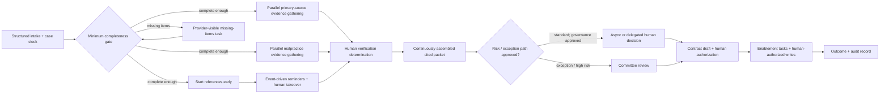

# Module 8 — The Full Engagement Simulation

- **Scenario:** Meridian Health Services
- **Engagement:** Provider Credentialing
- **Baseline:** 34-day average / 41-day P90 / 30-day commitment
- **Working time:** 770 minutes
- **Submission status:** complete

---

## Exercise 1 — The Diagnosis

### 1a — Flow analysis

#### Facts and calculation basis

**FACT FROM SCENARIO**

- Average elapsed time: **34 days**.
- P90 elapsed time: **41 days**.
- Total working time: **770 minutes**, stated as approximately **12.8 hours**.
- Contractual target: **30 days**.
- Approximately **40%** of cases miss the target.

The primary calculation treats the 34 days as **calendar elapsed time**, as instructed.

#### Primary flow-efficiency calculation

```text
Elapsed time = 34 calendar days × 24 hours/day × 60 minutes/hour
             = 48,960 calendar minutes

Working time = 770 minutes
             = 12.833 hours
             = 0.5347 calendar days

Flow efficiency = working time ÷ elapsed time
                = 770 minutes ÷ 48,960 minutes
                = 0.015727
                = 1.5727%
                ≈ 1.57%

Non-working/wait share = 100% − 1.5727%
                       ≈ 98.43%
```

**Result:** only about **1.57%** of average calendar elapsed time is active work; about **98.43%** is waiting, queueing, off-hours, handoffs, or otherwise unaccounted elapsed time.

#### Reconciliation check

The listed waits sum to:

```text
0 + 1.5 + 5 + 2 + 11 + 3 + 7 + 2 + 1 = 32.5 days

32.5 listed wait days + (770 ÷ 1,440) working calendar days
= 32.5 + 0.5347
= 33.0347 calendar days
```

That is **0.9653 day** below the supplied 34-day average. This is not silently corrected. Possible explanations include rounding, off-hours embedded inconsistently in the table, unlisted handoff delay, or different source populations. It requires validation against case-level timestamps.

#### Business-day ambiguity

If, contrary to the stated primary interpretation, “34 days” meant 34 eight-hour business days, the denominator would be `34 × 8 × 60 = 16,320` working-calendar minutes and the ratio would be **4.72%**. That is a sensitivity check only, not the primary answer. The contractual target and system timestamps must establish whether elapsed days are calendar days or business days.

#### Three longest waits, ordered

| Rank | Wait | Duration | Work that follows |
|---:|---|---:|---|
| 1 | Reference outreach/follow-up | **11 calendar days** | 2 hours active verification work |
| 2 | Committee decision queue | **7 calendar days** | 15-minute decision |
| 3 | Primary source verification queue | **5 calendar days** | 3.5 hours active verification work |

#### True system constraint

The working diagnosis is that Meridian's constraint is **not the speed of credentialing labor; it is the queue-and-decision operating model that serializes work around external reference responses and batched committee decisions without one consistently used workflow record**. The 11-day reference cycle is the largest current delay, while the 7-day queue for a 15-minute committee decision is the clearest internally controllable manifestation. This is a system constraint rather than a single slow employee or team; discovery must determine whether reference waiting, committee governance, or upstream incompleteness is the dominant causal constraint by case segment.

#### CEO-ready explanation for Diane

A credentialing case receives only about 12.8 hours of active work but takes 34 calendar days to finish, so roughly 98% of the elapsed time is spent waiting rather than being processed. The largest delays are 11 days for references, seven days for a short committee decision, and five days before primary-source verification; speeding up individual tasks alone will not reliably bring Meridian below its 30-day commitment.

---

### 1b — Why the previous initiatives failed

The diagnosis below uses the course mechanisms—shared context, identity, and accountable execution—without claiming facts not present in the scenario.

#### 1. Internal policy chatbot — deployed, about 4% weekly usage

**Mechanism of failure**

- The project appears to have optimized deployment rather than a specific workflow outcome. Four-percent weekly usage shows weak adoption, but the more important absence is a defined operational problem and an outcome measure tied to use.
- **Shared context:** a chat interface does not by itself resolve inconsistent taxonomy, unclear source authority, stale policy content, or fragmented work. If users cannot tell whether an answer is current and authoritative, they rationally return to known channels.
- **Identity:** the case provides no evidence that the chatbot acted under a bounded identity or needed to act at all. If it only answered questions, identity may not have been the primary failure; the key unanswered questions are who owned its corpus and who was accountable for an answer.
- **Accountable execution:** usage was measured, but no operational KPI was attributed to the chatbot. A usage statistic cannot show reduced handling time, fewer errors, or faster decisions.

**Diagnosis:** an optional destination was launched without being embedded in a high-value workflow, with no demonstrated trusted context or outcome accountability.

#### 2. Copilot licenses for 140 engineers — perceived speed, unchanged release cadence

**Mechanism of failure**

- The engineers' report that they are faster can be true while organizational throughput remains unchanged.
- **Bottleneck argument:** individual coding speed is not system throughput. If code review, test environments, integration, release approvals, deployment windows, architecture coupling, or remediation of technical debt constrains releases, producing code faster merely moves work into the next queue. The scenario proves only that release cadence remained every two weeks; discovery must identify which downstream constraint is binding rather than assume one.
- **Shared context:** coding assistance cannot compensate for missing architecture decisions, unclear ownership, duplicated components, or hard-to-reconstruct system knowledge.
- **Identity:** personal copilots typically assist authenticated engineers; this is less an autonomous-actor identity problem than a boundary and attribution question for generated changes.
- **Accountable execution:** perceived speed was measured informally, but lead time, review time, defect escape, deployment frequency, and change failure were not connected to license usage.

**Where technical debt fits:** the VP Engineering's concern is rational. Technical debt can be the delivery-system constraint that absorbs any local coding gain. AI can also worsen it by increasing change volume, duplicating patterns, or generating code faster than teams can review and operate. The engagement should pair any AI-enabled work with clearer ownership, observability, consolidation, and reduction of fragile workflow glue—not ask Engineering to ignore the debt.

#### 3. Claims document classification — 91% test accuracy, never shipped

**Mechanism of failure**

- A 91% aggregate test score does not define what happens to the remaining 9%, whether errors are concentrated in high-risk classes, or whether an individual classification can be reconstructed.
- **Shared context:** compliance lacked a case-level evidence trail showing the document, applicable rule/context, classification, confidence, and exception path.
- **Identity:** the automated classifier's authority was not defined. It was unclear, from the evidence given, what actor made the classification, what it was allowed to change, and who accepted residual risk.
- **Accountable execution:** misclassifications could not be traced, routed, reviewed, corrected, and tied to downstream impact. Compliance's refusal was therefore a rational control response, not resistance to innovation.

**Diagnosis:** the pilot optimized model accuracy but did not design the operating controls needed to handle errors safely.

#### 4. Three teams independently built retrieval systems

**Mechanism of failure**

- **Shared context:** the teams lacked a common inventory, authoritative corpus, reusable retrieval service/pattern, and visibility into parallel work. Their systems may also encode different source sets and freshness rules.
- **Identity:** separate systems create separate access paths and potentially inconsistent permissions. Even if each team's access was valid, there was no evident common identity model or separation of read/write boundaries.
- **Accountable execution:** no owner could attribute duplicated spend, retrieval quality, source freshness, or business outcomes across the three implementations.

**Diagnosis:** this is an operating-model and ownership failure made visible through technology duplication. Consolidation should not mean blindly keeping one implementation; Meridian should first compare corpus authority, controls, usage, and maintainability.

#### Cross-initiative pattern

Meridian repeatedly funded a tool or local capability before specifying the constrained workflow, the authoritative context, the actor's authority, the exception path, and the outcome measure. The result was adoption without impact, local speed without throughput, accuracy without deployability, and duplicated infrastructure without shared ownership.

---

### 1c — The three conditions

#### Shared context

##### What is fragmented

- **SharePoint:** approximately 400,000 documents with inconsistent taxonomy. Search scope, authority, currency, duplication, and ownership are therefore uncertain.
- **Verification spreadsheet:** the verification team conducts much of the live work in a shared spreadsheet, creating an operational record outside the intended workflow platform.
- **ServiceNow:** workflow tracking exists but is inconsistently used, so status and timestamps are incomplete or reconstructed later.
- **Oracle and mainframe:** provider/claims data and eligibility reside in separate systems. The case does not establish stable cross-system identifiers or a unified view.
- **Tacit knowledge:** 11 verification specialists, averaging nine years of tenure, hold substantial decision and exception knowledge that is not fully represented in systems.
- **Three retrieval systems:** separate teams duplicated discovery and likely created competing representations of policy context.

##### Where knowledge is trapped

Knowledge is trapped in document libraries with weak taxonomy, spreadsheet cells and comments, inconsistent ServiceNow records, system-specific schemas, and the experienced verification team's judgment about exceptions, evidence quality, escalation, and sequencing.

##### Who pays the reconstruction cost

- Intake and verification staff reconstruct case completeness and history.
- Credentialing analysts reconstruct evidence for committee packets.
- Committee members spend scarce attention resolving missing or inconsistent context.
- Operations and contracting reconcile decisions across four enablement systems.
- Engineering recreates retrieval and integration capabilities.
- Compliance and Security reconstruct what automated systems did after the fact.
- Providers and Meridian ultimately pay through delay, rework, penalties, and possible provider loss.

#### Identity

##### What exists today

**FACT FROM SCENARIO:** Meridian has an Azure tenancy that is moderately well governed, and Security is strict and competent.

**UNKNOWN TO VALIDATE:** the case does not establish the current Microsoft Entra ID tenant design, managed-identity availability for the proposed hosting model, service-principal inventory, Conditional Access policies, privileged access process, SharePoint permission hygiene, ServiceNow ACL model, Oracle grants, mainframe integration identity, or secrets-management pattern. It would be incorrect to claim Meridian presently has no identity model.

##### What automated actors would need

- A distinct Microsoft Entra application identity for each deployed agent or bounded service; no shared omnibus “AI” account.
- Azure Managed Identity where the compute service supports it; otherwise a narrowly scoped service principal with credentials/certificates protected in Azure Key Vault.
- Azure RBAC and resource-specific controls, plus SharePoint permissions, ServiceNow roles/ACLs, and Oracle read-only views or narrow grants.
- Separate identities and deployment boundaries for intake, evidence collection, outreach, packet preparation, and any enablement action; do not let a retrieval component inherit write authority.
- Explicit read/write boundaries, case/record scope where enforceable, least privilege, short-lived credentials, network restrictions/private endpoints where technically supported, and centralized logging.
- Human identity attached to approvals and overrides.
- A rapid revoke path: disable the Entra service principal/managed identity or role assignment, revoke ServiceNow/API access, disable integration credentials, and stop the workload.
- No autonomous mainframe or legally significant verification write is assumed until interface, control, and compliance requirements are validated.

#### Accountable execution

##### What is measured today

The scenario provides average elapsed time (34 days), P90 (41 days), 770 minutes of working time, a 30-day contractual target, roughly 40% target misses, a 4% weekly chatbot usage rate, unchanged two-week release cadence, and 91% classifier test accuracy.

##### What can be attributed today

Only coarse associations are available: chatbot usage, Copilot access and reported individual speed, classifier test accuracy, and aggregate credentialing performance. None demonstrates a defensible chain from an AI action to an operational outcome.

##### What remains invisible

- Case-level queue entry/exit and reasons for waiting.
- Which source, rule, version, and evidence supported a recommendation.
- Whether a human accepted, modified, or rejected an automated recommendation.
- Exception frequency, rework, quality, and downstream harm by case type.
- Which actor changed which system and under what authority.
- Cost and usage by workflow/outcome rather than by generic license or project.
- Whether missing ServiceNow events reflect no action, spreadsheet work, or late data entry.

##### Required trace from action to outcome

A reconstructable chain should link:

```text
case/request
→ authenticated human or agent actor
→ timestamped workflow state
→ retrieved source IDs, versions, and citations
→ model/tool version and execution metadata
→ recommendation plus confidence/exception flags
→ human approval, edit, rejection, or escalation
→ system write and before/after state
→ final credentialing decision
→ elapsed time, SLA result, rework, and quality outcome
```

The workflow record should be the correlation spine. Detailed technical logs can remain in Azure logging/monitoring, while the durable business decision record, evidence references, approvals, and resulting state are linked from the ServiceNow case.

#### Severity ranking

1. **Accountable execution — most severe.** Meridian has spent about $3.4M without an identifiable operational KPI improvement, and the classifier could not ship because error handling was not reconstructable. This condition directly blocks value claims and safe deployment.
2. **Shared context — second.** Fragmented records and tacit knowledge create daily reconstruction cost, duplicate retrieval systems, inconsistent handoffs, and unreliable automation inputs. It is likely a major cause of delay and rework.
3. **Identity — third, but still release-gating.** Security has already rejected a project over data residency, and any agent touching provider data requires bounded identity and permissions. It ranks third because the case shows moderate Azure governance and does not prove identity is currently broken; discovery may raise its severity quickly.

This ranking is a prioritization, not a sequence in which identity can be postponed. Identity and residency controls are prerequisites for even the first production shipment.

---

### 1d — Uncomfortable finding

#### Major non-technology problem

Meridian does not appear to have one enforced, end-to-end credentialing operating model. Work is split between a shared spreadsheet and inconsistently used ServiceNow, committee decisions are batched behind a seven-day average wait for 15 minutes of work, ownership across intake/verification/committee/contracting/operations is fragmented, and critical rules live in the heads of 11 long-tenured specialists. The technology symptoms—missing traceability, duplicated retrieval, manual packet reconstruction, and poor measurement—are downstream of unclear process ownership, decision rights, adherence, and incentives.

This is **not** a finding that the verification team is the problem. Their spreadsheet and tacit practices may be rational adaptations to a workflow system that does not fit the real work. Imposing more data entry or automating around them would likely increase hidden work and resistance.

#### What Charles should say

> “The largest obstacle is not that Meridian lacks another AI tool. Credentialing is being run through two operating records—the spreadsheet people need to get the work done and ServiceNow, which is not consistently the real source of status. At the same time, cases queue for committee cadence and key exception rules live with experienced specialists. We should treat those specialists as the designers of the future workflow, establish one accountable process owner and one minimum case record, and change the decision cadence where governance permits. Otherwise, automation will make the existing fragmentation move faster without improving the 34-day outcome.”

#### Who should hear it

Say it first to **Diane as executive sponsor**, privately and directly. Then bring the same evidence—not a softened alternative—to a joint working session with the credentialing process owner/leader, verification-team representatives, committee leadership, Compliance, the VP Engineering, Security, ServiceNow ownership, and Operations. Committee representatives must be present because Diane cannot unilaterally change physicians' participation or regulatory governance.

#### How to say it without blame

- Start with the time data and dual-record observation, not judgments about people.
- Describe the spreadsheet as a signal that the formal workflow does not serve the work, not as noncompliance by default.
- Ask the 11 specialists to map exceptions, workarounds, and evidence thresholds; credit them as domain experts.
- Separate mandatory regulatory gates from inherited habit.
- Make leadership own decision rights, committee service expectations, workflow adherence, and trade-offs.
- Require redesigned fields/events to replace existing work rather than add documentation burden.

---

### Assumptions and decisions preserved

#### Assumptions used

1. The supplied 34 days is average **calendar** elapsed time.
2. The listed waits are expressed in calendar days unless Meridian's source data proves otherwise.
3. The 770 minutes is total active touch time per average case and does not double-count parallel work.
4. “Wait before” describes average queue/wait preceding the named step, but the labels and populations require validation.
5. The exercise's reference to a twice-monthly committee cadence is treated as a case condition to validate against calendars and timestamp data.

#### Decisions made for the diagnosis

1. Do not call verifier capacity the constraint based only on 3.5 hours of primary-source work.
2. Treat the dominant constraint as wait-state and decision-cadence design, with reference outreach the largest delay and committee batching the most controllable internal delay.
3. Do not claim which engineering stage constrains the two-week release cadence without value-stream data.
4. Do not treat 91% accuracy as deployability.
5. Do not assume missing identity controls; mark them for discovery.

### Ambiguities to resolve before Exercise 2

1. **SLA clock:** Is the 30-day contractual target measured in calendar days or business days? What starts and stops the clock, and do provider-caused delays pause it?
2. **Timeline reconciliation:** Why do listed waits plus active work total 33.03 days rather than 34? Are there unlisted handoffs, weekends, rework, or rounding?
3. **Wait semantics:** Are the wait figures mutually exclusive sequential averages, or do some overlap? What exactly occurs during the 11 reference days?
4. **Committee governance:** Is twice-monthly cadence fixed by bylaws/regulation or convention? Which case classes legally require synchronous committee review? Who can approve asynchronous or exception-based paths?
5. **Case volume and segmentation:** Monthly volume, backlog, provider types, jurisdictions, risk tiers, clean-case percentage, and seasonality are absent. These are needed to estimate capacity and target impact.
6. **Quality baseline:** Current rework, false-complete rate, verification defect rate, exception rate, adverse findings, post-credentialing corrections, and audit findings are not provided. A guardrail cannot receive a credible numeric target yet.
7. **Reference baseline:** Channel mix, response rate, number of attempts, time-to-first-contact, provider/reference responsibilities, and acceptance requirements are unknown.
8. **System of record:** Is ServiceNow authorized and configured to become the enforceable workflow record? Who owns its schema, integrations, roles, and adoption?
9. **Azure entitlements:** Which Azure-native search, model, integration, monitoring, and private-network capabilities are already licensed/approved? “No new platform licenses” rules out assumptions.
10. **Data residency:** Which data classes, approved Azure regions, model endpoints, retention rules, and cross-border restrictions caused the previous rejection?
11. **Decision rights and ownership:** Who is the named end-to-end credentialing process owner, who owns committee policy, and who accepts compliance risk?
12. **November timing:** The exact CEO review date and the latest measurement window needed for a defensible result are not specified.

These questions should be resolved through timestamp analysis, policy review, and working sessions—not by inventing precision in Exercise 2.

---

## Exercise 2 — Engagement Design

### 2a — Outcome

#### Metric choice

##### Primary business outcome

**Primary metric: percentage of in-scope provider credentialing cases completed within the contractual 30-calendar-day SLA.**

This is preferable to average elapsed time as the primary metric because an average can improve while a large tail still breaches Meridian's contractual commitment. It is preferable to P90 as the primary metric for a 90-day engagement because P90 is statistically unstable in a small pilot and sensitive to low volume. SLA attainment directly expresses the obligation that creates penalties and provider-loss risk.

The other measures remain diagnostics:

- **Average elapsed time:** shows broad movement but can hide the tail.
- **P90 elapsed time:** shows whether the worst routine cases improve, but requires adequate cohort size.
- **Active touch time:** distinguishes labor savings from actual cycle-time improvement.

No adoption, prompt count, model accuracy, or agent-usage measure is a substitute for this business outcome.

#### Baseline

- **Scenario baseline:** approximately **60% completed within 30 days**, inferred from “approximately 40% miss target.”
- **Diagnostic baselines:** average **34 days** and P90 **41 days**.
- Because “approximately 40%” is not a validated source-system result, the baseline remains approximate until discovery.

#### Baseline verification

During Days 1–10, construct a case-level baseline from the most recent complete pre-intervention arrival cohort, preferably at least 90 days of arrivals if volume supports it. Use:

1. intake receipt/log timestamps;
2. ServiceNow case and milestone events;
3. the verification spreadsheet's operational timestamps/statuses;
4. committee decision records;
5. contracting/countersign records; and
6. the first reliable final-enablement timestamp across the four systems.

Records will be joined using the provider credentialing case ID; where that ID is missing or inconsistent, retain a reconciliation table rather than silently fuzzy-matching providers. Sample cases will be manually traced with Intake, Verification, Credentialing, Contracting, and Operations. Report missingness and disagreement by source. Do not certify ServiceNow as authoritative merely because it is the intended workflow tool.

**Baseline acceptance gate:** Diane, the credentialing process owner, Compliance, and the measurement owner approve the clock definition, denominator, exclusion rules, source precedence, and data-quality limitations before an intervention result is reported.

#### Proposed engagement target

> **PROPOSED ENGAGEMENT TARGET:** At least **75% of eligible pilot-cohort cases complete within 30 calendar days**—reducing the miss rate from approximately 40% to no more than 25%—for applications received during Days 31–60 and observed through each case's Day-30 deadline.

This is a proposed target, not a Meridian commitment or a forecast. It is a deliberately material but not falsely precise 15-percentage-point improvement. It must be revisited if the verified baseline, pilot volume, case mix, or contractual clock differs materially from the scenario.

##### Target date and measurement window

- **Pilot arrival cohort:** applications received from Day 31 through Day 60.
- **Primary Day-90 readout:** whether each case completed by its own 30-day deadline. A case not completed by that deadline is an SLA miss even if final completion occurs later.
- **Diagnostic follow-up:** calculate final average and P90 once the cohort has fully matured, preferably through Day 105 or at least 45 days after the last cohort entry. This follow-up does not change the Day-90 SLA result.

#### Reproducible measurement method

For each included case:

```text
clock_start = authoritative application-received timestamp
clock_end   = authoritative all-required-enablement-complete timestamp
elapsed_calendar_days = (clock_end - clock_start) / 24 hours
sla_met = elapsed_calendar_days <= 30.000 days

SLA attainment = count(sla_met) / count(included cases) × 100
```

Implementation rules:

1. Freeze a versioned cohort manifest containing case IDs, inclusion/exclusion reason, clock start, deadline, and segment fields.
2. Derive milestones from immutable or append-only events rather than editable “current status” alone.
3. Use one documented timezone and normalize daylight-saving behavior.
4. Keep the original timestamp, source system, ingestion time, and any correction event.
5. Publish numerator, denominator, missing-data count, case-mix distribution, and confidence interval; do not publish a percentage without its denominator.
6. Report results by provider type, insurer/network, jurisdiction, risk/exception category, and completeness-at-entry when volume permits. Small groups are suppressed according to Meridian privacy policy.
7. Compare the pilot with the validated historical baseline and, if a genuinely comparable non-pilot cohort exists, show it separately; do not claim randomization or causality from a convenience comparison.

#### Cohort inclusion and exclusion

##### Include

- All real provider applications in the predeclared pilot slice received during the cohort window.
- Both standard and exception cases in that slice; exceptions are tagged, not removed to improve the result.
- Incomplete-at-entry cases unless the contract explicitly defines a different clock start.
- Cases that miss the SLA, remain open, or require rework.

##### Exclude, with reason recorded before outcome review

- Test/training records.
- Exact duplicate records representing the same application; retain one canonical case and the duplicate-resolution audit trail.
- Applications definitively withdrawn by the provider before a credentialing decision; report withdrawals separately with elapsed time and reason.
- Cases outside the predeclared insurer/network, provider class, jurisdiction, or pilot start dates.

Do **not** exclude hard cases, adverse findings, missing references, internal delays, or cases transferred between teams. Any post hoc exclusion is shown in a sensitivity analysis and cannot improve the primary result silently.

#### Clock pauses

**UNRESOLVED CONTRACT QUESTION:** The scenario does not say whether the contractual clock pauses for provider-caused delays, force majeure, or formally requested holds.

Until contract review resolves this:

- Primary operational reporting uses an **unpaused calendar clock** from receipt through enablement.
- If the contract permits specific pauses, report a second **contract-adjusted SLA measure** with each pause event, reason code, start/end, approving human, and supporting evidence.
- Automated actors cannot create or approve a clock pause.
- Internal queues, unavailable staff, committee scheduling, system downtime, and failed outreach are not pauses unless the actual contract explicitly says so.

#### Falsification criterion

The claim “the engagement improved SLA performance” is **falsified or not established** if any of the following occurs:

1. fewer than 75% of the predeclared, matured pilot cohort meet 30 days;
2. the result depends on post hoc exclusions, undocumented pauses, or changed clock definitions;
3. cohort size or timestamp completeness is insufficient to support the claim;
4. improvement disappears after a predeclared case-mix sensitivity check and no plausible operational explanation is evidenced; or
5. the quality/compliance guardrail breaches the pre-agreed non-inferiority boundary.

A reduction in touch time, positive user feedback, high model accuracy, or increased usage does not override these conditions.

#### Secondary guardrail

**Guardrail: material verification defects per 100 completed credentialing cases.**

A material verification defect is a missing, incorrect, expired, mismatched, or unresolved item of required verification evidence discovered through independent QA, audit, committee review, or post-credentialing correction that requires reopening/correction or could alter the decision. Severity and discovery stage are reported separately.

> **BASELINE TO ESTABLISH DURING DISCOVERY**

A numeric target is not invented. Before pilot activation, Compliance and credentialing leadership will approve:

- the defect definition and severity levels;
- independent sampling/review method;
- the historical baseline and its confidence limits;
- a non-inferiority boundary; and
- mandatory reporting of any incorrectly approved case or serious compliance event, regardless of rate.

This guardrail matters because faster processing is not success if Meridian approves a provider on incomplete or incorrect evidence, creates more rework, or makes later audit reconstruction impossible.

---

### 2b — Scope: first 90 days

#### Pilot slice

**DESIGN HYPOTHESIS TO VALIDATE:** Select one insurer/network, one jurisdiction, and one sufficiently common provider class with meaningful volume, representative workflow, and no uniquely high-risk exception regime. Selection occurs during Days 1–3 using volume, case-mix, compliance, and sponsorship data—not convenience alone.

#### In scope

1. A bounded provider-credentialing pilot cohort.
2. One minimum case record and append-only milestone/event history.
3. Automatic elapsed-time and queue-age measurement.
4. Reference-outreach instrumentation, approved templates, timed reminders, escalation, and human takeover.
5. Earlier initiation and safe parallelization of eligible checks.
6. Human-reviewed evidence collection/normalization for primary-source and malpractice work.
7. A curated first credentialing corpus, not enterprise search.
8. Continuous draft committee-packet preparation with citations.
9. A governance proposal and, only if approved, a bounded committee-cadence or low-risk decision-path experiment.
10. Case-level traceability, cost/usage attribution, Security review, and runbooks.
11. Documentation of verification decision rules, examples, counterexamples, and exceptions with the 11 specialists.

#### Explicitly out of scope

| Exclusion | Why excluded in the first 90 days |
|---|---|
| Cleaning or indexing all 400,000 SharePoint files | Expands scope without proving credentialing value; increases stale/conflicting-content and permission risk. |
| Replacing the mainframe | Not necessary to test credentialing flow; creates disproportionate technical and operational risk. |
| Rebuilding ServiceNow | The goal is a minimum enforceable record and event spine using existing capabilities, not platform replacement. |
| Solving all Meridian AI governance | Define controls for this workflow and produce reusable patterns; enterprise governance is a separate mandate. |
| Eliminating enterprise technical debt | Address only debt that directly blocks the bounded workflow, observability, identity, or supportability. |
| Automating final primary-source determinations | Evidence gathering can be assisted; compliance-significant judgment remains human unless policy and law explicitly allow otherwise. |
| Automating committee decisions | Decision support is in scope; autonomous approval is not. |
| Autonomous contract countersignature | Legal commitment remains with authorized humans. |
| Autonomous writes to all four enablement systems | High blast radius and hard reconciliation; first 90 days prepare tasks/checklists and require human authorization. |
| Broad enterprise chatbot or AI platform | Repeats the prior solution-first pattern and conflicts with no-new-licence constraints. |
| Echo or Chiron | Explicitly prohibited for this engagement. |
| New platform licences | Explicit fiscal constraint; every dependent Azure capability requires entitlement verification. |

These exclusions preserve a measurable causal path, reduce Security review surface, and prevent workflow redesign from becoming a disguised platform transformation.

#### First shipment in Days 1–14

**First real shipment:** a **structured minimum credentialing case record plus append-only workflow/reference event ledger for the pilot slice**, implemented in existing ServiceNow capabilities if the Day-5 feasibility check confirms enforceable fields, ACLs, and team adoption.

It includes required pilot fields, a case ID, clock start/deadline, milestone timestamps, owner, wait reason, reference attempts/responses, exception flags, next action, and an automatically calculated case/queue age. Existing source fields are reused or auto-populated where possible; the verification team does not duplicate data entry into a third record.

Why this is the best first shipment:

- it changes actual daily work and handoffs rather than demonstrating a chatbot;
- it creates the evidence needed to determine where time is really lost;
- it is low regulatory consequence because it initially records and routes work rather than making decisions;
- it is reversible through a pilot scope/feature flag and exportable event log;
- it becomes the accountability spine for later retrieval, outreach, recommendations, approvals, and outcome measurement; and
- it tests the uncomfortable organizational issue: whether Meridian can enforce one minimum case record.

**Day-14 stop condition:** if ServiceNow cannot support an enforceable pilot record without rebuilding or unlicensed modules, do not create a permanent shadow workflow. Run a time-limited measurement ledger using an already approved Azure storage capability **only if available and approved**, and ask Diane to choose between fixing the ServiceNow minimum path or narrowing/stopping the production pilot.

#### 90-day engagement shape

| Period | Outcome | Artifact / system change | Evidence collected | People required | Decision gate |
|---|---|---|---|---|---|
| **Days 1–14** | Establish trustworthy baseline and make real pilot cases observable | Minimum case record; append-only milestone/reference events; cohort definition; clock rules; data-quality report; initial runbook | Source agreement/missingness, queue ages, reference attempts, case walkthroughs, user burden, ServiceNow feasibility | Diane/delegate, process owner, 2–3 verification specialists, Intake, Credentialing, ServiceNow owner, data analyst, Compliance, Security, Engineering | **Gate 1:** approve metric, cohort, system-of-record path, Security constraints, and whether data capture replaces rather than adds work |
| **Days 15–30** | Reduce reconstruction and prepare safe interventions | Curated credentialing corpus; metadata/provenance; read-only retrieval; reference templates/escalation rules; first exception taxonomy; shadow-mode evidence recommendations and packet drafts | Retrieval relevance/citation review, false/missing evidence, manual vs assisted prep time, outreach baseline response curves, override reasons | Verification specialists, Compliance, credentialing analyst, SharePoint owner, Security, Engineering | **Gate 2:** corpus ownership/freshness accepted; shadow outputs meet quality threshold; approved outreach channels/templates; no production model access to provider data without residency approval |
| **Days 31–60** | Operate redesigned pilot for eligible cases | Earlier reference initiation; event-driven reminders with human takeover; parallel eligible checks; draft evidence records; continuously assembled committee pre-read; human approvals captured | SLA trajectories, time-to-first-reference response, queue-age distribution, defect guardrail, overrides, response rate by channel, token/cost if models used | Pilot team, designated verification rule owners, Intake, committee coordinator, Compliance, Security/Engineering support | **Gate 3:** continue, modify, or stop each intervention independently; any outreach degradation or guardrail breach triggers rollback/human-only path |
| **Days 61–90** | Test sustainable operating model and produce defensible outcome | Approved committee-cadence/fast-lane experiment if governance permits; hardened runbooks, ownership, revoke procedures, support model, outcome dashboard | Mature SLA result, defect guardrail, adoption burden, queue changes, audit replay, cost per completed case, non-pilot comparison if valid | Diane, committee leadership/physicians, process owner, Verification, Compliance, Security, VP Engineering, Operations | **Gate 4:** scale, extend, retain only instrumentation, or stop; no scale without accountable owner, quality evidence, security approval, and support capacity |

---

### 2c — Workflow redesign

#### Version A — “Driveshaft”: accelerate work, preserve the process shape

This version assists completeness checking, evidence collection, malpractice review preparation, outreach drafting, committee packet preparation, contract preparation, and enablement checklists, but leaves all waits, sequence, committee cadence, and decision rights unchanged.

##### Quantitative effect

Baseline:

```text
Elapsed time = 34 calendar days = 816 hours
Active work  = 770 minutes = 12.833 hours = 0.5347 calendar day
```

Assume, generously, that every minute saved lies on the critical path and translates one-for-one into elapsed-time reduction. That is the **maximum** effect when queues remain unchanged.

| Active-work reduction | Minutes saved | Hours saved | Calendar days saved | New elapsed time | Reduction in 34-day elapsed time |
|---:|---:|---:|---:|---:|---:|
| **25%** | 192.5 min | 3.208 h | 0.1337 day | **33.8663 days** | **0.39%** |
| **50%** | 385 min | 6.417 h | 0.2674 day | **33.7326 days** | **0.79%** |
| **100% — impossible upper bound** | 770 min | 12.833 h | 0.5347 day | **33.4653 days** | **1.57%** |

> **Visually important contrast:** cutting active work in half does **not** cut a 34-day process to 17 days. It removes at most **6.42 hours**, leaving approximately **33.73 calendar days** if queues and cadence do not change.

Real improvement could be smaller because some assisted work is not on the critical path, saved time may occur during already-overlapping activity, and generated output may add review time. Driveshaft can reduce labor burden and fund redesign capacity, but it is not a credible standalone answer to the SLA problem.

#### Version B — redesign the workflow shape

##### Current shape


##### Proposed shape



The diagram shows candidate paths, not pre-approved policy. Any low-risk, asynchronous, delegated, or exception-only decision path is a **DESIGN HYPOTHESIS — REQUIRES GOVERNANCE / REGULATORY VALIDATION**.

##### Changes and assumptions

| Area | Current | Proposed | Expected effect | Assumption / risk |
|---|---|---|---|---|
| Intake | Case logged; completeness waits 1.5 days | Create minimum case record and clock immediately; prompt for missing required fields | Removes reconstruction and makes queue age visible | ServiceNow fields/ACLs can be enforced without burdensome duplicate entry |
| References | Begin late; 11-day average wait | Start once minimum identity/contact prerequisites are met, potentially alongside PSV; record every attempt/response | Overlaps external waiting with internal work | **DESIGN HYPOTHESIS:** policy permits earlier contact and required reference set is known |
| Reference follow-up | “Wait 11 days” as a block | Measure response curve; timed reminders; approved channel choices; threshold escalation; human takeover on nonresponse or degraded channel performance | Converts passive delay into controlled events; may remove 2–4 net days | Contact preferences, consent, channel availability, and message trust must be validated; automation may lower response rate |
| Provider visibility | Missing references/status may require manual inquiry | Show only approved missing-reference status and provider action through an existing approved channel | Reduces avoidable back-and-forth | Existing channel and entitlement must exist; do not expose reference content or adverse details |
| Reference requirement | All cases appear to follow one path | Determine whether policy legally allows waiver/different evidence for defined case classes | Could avoid unnecessary waits | **DESIGN HYPOTHESIS — REQUIRES GOVERNANCE / REGULATORY VALIDATION**; never infer waiver from model output |
| Primary-source verification | Waits 5 days and begins sequentially | Pull eligible work when minimum prerequisites are present; run independent checks in parallel; agent gathers/normalizes/compares | May remove 1–2.5 queue days and reduce touch time | Source availability and staff capacity; human retains regulated determination |
| Malpractice review | Follows PSV sequentially | Gather permitted malpractice evidence in parallel where dependencies allow | Overlaps a 2-day wait with other work | Rules may require a verified identity or preceding check; validate dependencies |
| Committee packet | Prepared after references, then waits 3 days | Build packet continuously from cited evidence; flag missing items rather than reconstruct at end | Reduces packet queue and pre-read churn | Packet format and evidence sufficiency approved by committee/Compliance |
| Committee cadence | 7-day average queue for 15-minute decision | Options: more frequent short sessions, asynchronous voting, delegated standard-case approval, or exception-only committee | Potentially removes 2–5 days | **DESIGN HYPOTHESIS — REQUIRES GOVERNANCE / REGULATORY VALIDATION**; physician availability, bylaws, quorum, and law may constrain it |
| Contract | Waits 2 days after decision | Prepopulate approved template after decision prerequisites; human/legal authorization and countersignature remain | May remove part of handoff delay | Correct template, authority, and decision status must be machine-verifiable |
| Enablement | Sequential work across four systems; 1-day wait | Create synchronized tasks/checklists; human-authorized execution and reconciliation | Reduces lost handoffs and makes partial enablement visible | No autonomous cross-system writes in first 90 days; legacy interfaces may limit automation |
| Exceptions | Often discovered at handoff | Explicit exception taxonomy, owner, due date, evidence, and escalation in minimum case record | Less rework and invisible waiting | Specialists must own taxonomy evolution; too many required fields could create workarounds |

##### Parallelization candidates

Subject to policy/dependency validation:

1. References can begin after a minimum completeness gate rather than after malpractice review.
2. Independent primary-source checks can be gathered concurrently rather than as one serial block.
3. Malpractice evidence gathering can overlap with other verification work.
4. Committee packet assembly can occur continuously as evidence arrives.
5. Contract template preparation can begin before committee decision, while execution remains blocked until an authorized decision.
6. Enablement plans/tasks can be staged before countersignature, while system writes remain blocked until contractual authorization.

A dependency matrix created with the specialists will label each prerequisite as legal/regulatory, policy, data, or habit. Only policy/habit dependencies with accountable approval are candidates for removal.

##### Improvement estimate

###### Mathematically removable wait

The three largest listed waits total:

```text
11 reference + 7 committee + 5 primary-source queue = 23 calendar days
```

Twenty-three days is a mathematical exposure, **not** a removable forecast. External response time, legally required review, staffing, case complexity, and overlap prevent simply subtracting all 23 days.

###### Reasoned components

- Earlier/event-driven references: **2–4 days** of net elapsed improvement if response curves and channel performance support it.
- Pull/parallel evidence work: **1–2.5 days**.
- Continuous packet and triggered handoffs: **0.5–1.5 days**.
- Committee redesign: **2–5 days**, entirely governance-dependent.
- Active-work assistance: approximately **0.1–0.27 day** at 25–50% touch-time reduction.
- Overlap/double-counting discount: approximately **1–3 days**, because improvements do not add independently.

> **PROPOSED DESIGN RANGE:** approximately **5–10 calendar days** of net average elapsed-time improvement for the validated pilot, implying a directional average of roughly **24–29 days** from a 34-day baseline.

This is a design hypothesis, not a promise. Without committee-path approval, the more defensible range is approximately **3–6 days**, implying roughly **28–31 days**. Case-mix effects and reference response behavior could reduce either range. The 30-day commitment is therefore feasible to test, not guaranteed by arithmetic.

##### What this redesign asks of the 11 verification specialists

Their average nine-year tenure makes them the highest-value source of operational truth in the engagement.

1. **Shadowing and walkthroughs:** observe real standard, incomplete, adverse, and ambiguous cases; record what evidence changes a decision and why.
2. **Decision-rule elicitation:** use “if/then/because” interviews tied to actual cases, not generic policy workshops.
3. **Exception taxonomy:** classify missing evidence, source conflict, name/identity mismatch, expiration, jurisdiction variance, adverse history, unreachable reference, and policy ambiguity.
4. **Examples and counterexamples:** for each proposed rule, capture a case that should match, a near miss that should not, and the evidence required to distinguish them.
5. **Recommendation review:** specialists review shadow-mode agent outputs, mark correct/incorrect/incomplete, and supply reason codes; disagreement becomes a rule-review item, not hidden override.
6. **Rule ownership:** nominate rotating verification rule owners who approve corpus/rule changes with Compliance and receive time in workload planning for this responsibility.
7. **Role evolution:** reduce repetitive searching, chasing, copying, and packet reconstruction; increase exception resolution, source-quality judgment, coaching, QA sampling, rule stewardship, and process-improvement authority.
8. **No silent extraction:** transcripts and examples are reviewed by participants before publication; sensitive case material is minimized; attribution follows Meridian policy.

##### Uncomfortable adoption paragraph

This redesign asks experienced specialists to expose workarounds and judgment that may have protected both the process and their professional value for years. A request to “document everything you know” can reasonably sound like knowledge extraction before headcount reduction, especially after disappointing AI programs. Leadership must state what workforce decisions are and are not connected to the pilot, give specialists decision rights over rules and stop conditions, allocate paid capacity for redesign, show where their corrections changed the system, and measure removed toil rather than “knowledge captured.” If Meridian cannot make those commitments credibly, resistance is rational and the pilot should not pretend that training will solve it.

---

### 2d — Build the three conditions using the existing estate

#### Shared context

##### First credentialing corpus only

Do not index all SharePoint content. Create a permission-scoped **Provider Credentialing — Controlled Corpus** containing current credentialing SOPs; pilot insurer/network and jurisdiction rules; reference, primary-source, malpractice, committee, escalation, and packet procedures; approved decision aids; current Compliance guidance; and a small, access-restricted set of representative cases, de-identified where possible.

##### Canonical and derived layers

Approved SharePoint documents remain canonical, with named owners and version history. Search chunks and index records are disposable derivatives. Use an existing Azure-native search entitlement if available; otherwise use an already approved Azure compute/storage pattern. **VERIFY EXISTING AZURE ENTITLEMENT.** Do not buy a platform or reuse one of the three retrieval systems without comparing controls and quality.

##### Ownership

The end-to-end credentialing process owner owns the corpus. Named policy/Compliance owners own each document type; Engineering/SharePoint is technical custodian; designated verification specialists and Compliance steward rules. Every document has an individual owner and approver.

##### Metadata

Each canonical document and derived chunk carries its document and immutable version IDs; type; insurer/network; jurisdiction; relevant provider type and workflow step; effective, superseded, review, and next-review dates; owner and approver; approval and sensitivity status; permitted human/agent roles; source location; and supersession relationship.

##### Ingestion and update

After required metadata and approval are validated, extraction and indexing occur inside the approved Azure boundary. Permission/version metadata, citation resolution, and retrieval tests must pass before activation. Prior index versions remain auditable for the approved retention period.

##### Stale-content behavior

Superseded, expired, unapproved, or review-overdue material is excluded from recommendation context; humans may retrieve a watermarked historical version for audit. If no current source exists, the assistant routes to the owner rather than substituting a similar stale rule. Historical decisions retain citations to the exact version used. A scheduled incremental build is acceptable if approved eventing is unavailable.

##### Human and agent access

SharePoint permissions govern canonical access. Each automated identity retrieves only content it is authorized to access; the index must enforce or pre-segment permissions rather than rely on prompts. Raw case examples are not globally searchable. Recommendations display title, version, effective date, owner, and passage citation.

##### Evidence provenance

Retrieval records include document/version and passage IDs, timestamp, query or rule trigger, rank where relevant, and content hash. The case log stores references rather than uncontrolled copies unless records policy requires a snapshot.

#### Minimum case record

The record travels with the provider and eliminates handoff reconstruction. Require fields only when they replace work or provide control:

##### Identity and scope

immutable case ID; authoritative provider ID/source and safe matching attributes; receipt timestamp/source; insurer/network, jurisdiction, provider type; policy and case/risk path; owner and state.
##### SLA and workflow

clock start, deadline, age, and approved pause events; actor-stamped milestone history; current wait and start time; next action, owner, due/escalation date; completeness, missing items, duplicate/withdrawal status and reasons.
##### Verification evidence

rule-versioned checks and status; source ID/location, retrieval time, evidence version/hash, normalized value, original link, mismatch/expiry/adverse flags; exception severity, owner and disposition; human determination and rationale; automated execution ID.
##### References

governing requirement; approved contact/channel; timestamped attempts and template; delivery/response status and validated evidence; reminder, escalation, and human-takeover date. Generic telemetry contains no sensitive free text.
##### Decision and downstream state

packet version/completeness; approved committee or delegated path; named human decision, rationale, conditions and time; contract authorization; four-system enablement tasks with human authorizer and reconciliation; completion, SLA, rework, QA/audit and material-defect results.

#### Identity

##### Minimum automated actors

The 90-day design uses **three distinct automated identities**. Completeness checks and packet assembly are capabilities, not extra agents. There is no autonomous committee, contract-signing, regulated determination, or provider-enablement actor. Each workload uses Azure Managed Identity where supported, otherwise a dedicated Microsoft Entra service principal with unavoidable credentials in Key Vault. Human approvals retain personal identity.

##### Actor 1 — Workflow and timeline orchestrator

| Field | Design |
|---|---|
| Role and trigger | Deterministically validates minimum records, calculates clocks/queue age, creates bounded tasks/reminders, and appends events when pilot cases change or due dates are scanned. No model is required. |
| Access | Reads pilot case fields and approved rules. Writes only named minimum-record, task, timer/escalation fields and append-only pilot events. It cannot change evidence or determinations, pause clocks, close/approve cases, delete history, enable providers, or edit non-pilot cases. |
| Human authority | A human approves clock corrections, exception disposition, closure, and anything outside deterministic validation/task creation. Durable state stays in ServiceNow; transient state is discarded. |
| Enforcement | Entra authentication, Azure RBAC, ServiceNow OAuth/API identity and role/field/action ACLs, pilot predicate, rate limits, append-only history, and approved network allowlist/private connectivity. **VERIFY EXISTING AZURE ENTITLEMENT.** |
| Logging and revocation | Logs case/execution IDs, trigger and rule version, affected fields/events, before/after state, result and actor. Stop the workload, disable its identity or role, revoke ServiceNow access, and disable the pilot feature flag. |
| Blast radius | Integrity risk is limited to entitled pilot workflow fields and tasks, subject to the effective-entitlement correction below. |

##### Actor 2 — Reference outreach actor

| Field | Design |
|---|---|
| Role and trigger | Sends approved requests/reminders through an approved channel after human approval or a pre-approved timer rule; records events and routes failures. Templates are deterministic. |
| Access | Reads only case ID, display identity, approved reference contact/channel, requirement and attempt state, template and dates. Writes through the dedicated sender and to append-only outreach/next-action fields. It cannot invent or change recipients, generate free-form production messages, send unapproved attachments, waive references, change verification status, or bulk-message. |
| Human authority | Policy governs initial recipient/template approval. Bounces, negative or ambiguous responses, complaints, configured failures, or response degradation trigger human takeover. |
| Enforcement | Separate Entra and messaging identities; dedicated-sender/template API scope; outreach-only ServiceNow ACL; recipient/case/template allowlists; per-case/global rate limits; controlled egress; Key Vault if required. **VERIFY EXISTING AZURE ENTITLEMENT and messaging interface.** |
| Logging and revocation | Logs masked recipient reference, case/execution, channel, template, approval, attempt, delivery/response and takeover events. Disable sender/workload, remove assignments, revoke messaging credentials, cancel reminders, and set “manual outreach only.” |
| Blast radius | External communication, privacy, and reputation exposure is constrained to the effective pilot entitlement, approved recipients/templates, rate limits, and no attachments by default. |

##### Actor 3 — Evidence and packet preparation actor

| Field | Design |
|---|---|
| Role and trigger | On a human request or eligible task, retrieves approved rules/evidence, normalizes and compares values, flags problems, and drafts cited evidence and packets. It recommends; humans determine and approve. |
| Access | Reads the controlled corpus, pilot case, narrowly scoped Oracle read-only view if required, and allowlisted primary-source connectors. Writes only draft evidence, citations, flags, and packet artifacts. It cannot make final determinations, clear exceptions, change canonical content, train on case data, export broadly, vote, contract, or enable providers. |
| Case boundary | “Current case only” is valid only where downstream authorization enforces it. Otherwise the effective entitlement is the larger enumerable set, and that source is blocked pending narrowing, approved case-authorizing mediation/broker, or removal. No mainframe access is assumed. |
| Human authority | A verifier accepts or corrects each significant item and signs the determination; an analyst approves packet completeness. Provider-data model access requires prior Security approval. Execution context is transient; durable outputs and citations remain in the case record. |
| Enforcement | Dedicated Entra identity; Azure RBAC; controlled-corpus SharePoint permission; Oracle read-only view/grant plus feasible row/query constraints; draft-only ServiceNow ACL; connector and egress allowlists; approved private endpoints/network controls; Key Vault only where needed. **VERIFY EXISTING AZURE ENTITLEMENT.** |
| Logging and revocation | Logs case/execution, model/tool/version, template hash, evidence and source IDs, flags, artifact hash, human disposition/reason, usage/cost, errors and latency. Stop the workload and revoke Entra/RBAC, SharePoint, Oracle, ServiceNow, connector, queue, and model-endpoint access. |
| Blast radius | Confidentiality exposure equals the data its effective entitlement can enumerate; integrity exposure is limited to draft fields. Read-only views, controlled corpus, draft-only writes, export/rate limits, and mandatory human determination further contain it. |

##### Control types are not interchangeable

Entra authenticates the caller. Azure RBAC, SharePoint permissions, ServiceNow roles/ACLs, Oracle grants/views, messaging scopes, and field/action checks authorize it. Key Vault protects unavoidable secrets but grants no business access. Network controls restrict reachability but do not replace identity or authorization. Logs record actions but do not prevent them. Conditional Access protects appropriate human administration/approval paths; workload identity restrictions, RBAC, credentials, and network policy govern non-human actors.

#### Data residency and model data flow

**SECURITY VALIDATION REQUIRED BEFORE MODEL ACCESS TO PROVIDER DATA.** No production model receives provider PII, regulated evidence, or case narrative until Security approves the exact endpoint, region and failover behavior, processor/subprocessor terms, retention and abuse-monitoring behavior, encryption, logging, and network path.

- Policy retrieval should avoid provider PII and remain in the approved Meridian/Azure region.
- Completeness, routing, timers, events, and SLA calculations should be deterministic; if no model is needed, model calls are prohibited.
- Evidence extraction/normalization and packet summarization likely contain provider PII. They require the approved in-region/private endpoint or approved local path, no training or cross-case memory, approved transient retention, minimum necessary fields, and human review.
- Reference outreach uses approved deterministic templates through the existing messaging path; model-generated production text is initially prohibited.

Detailed evidence stays in approved Meridian-controlled records; generic telemetry contains identifiers and metadata, not full documents or prompts. Security, Privacy, Compliance, and Records Management set exact retention periods before production, and audit records remain queryable beyond six months.

#### Accountability

##### Reconstruction chain and systems of record

ServiceNow is the proposed workflow spine only if Gate 1 confirms enforceability, field history, ACLs, integration support, and pilot adoption. The immutable case ID links append-only workflow events; canonical evidence and exact version/hash citations; automated execution, model/tool/rule/config and output; named human approval/edit/rejection and reason; target-system action and before/after state; resulting workflow state; and the measured SLA, rework, defect, audit, usage, and cost outcome. Technical detail stays in approved Azure logs; durable recommendations, evidence references, approvals, and business state remain linked from ServiceNow. Target systems remain authoritative for their own state.

If ServiceNow cannot become the enforced spine, the Day-14 gate chooses remediation or narrower scope. A temporary approved measurement ledger cannot become a fourth permanent workflow system.

##### Correlation identifiers

The chain uses stable `credentialing_case_id`, immutable `workflow_event_id`, `execution_id`, `recommendation_id`, `approval_id`, `target_action_id`, and a propagated `correlation_id`; names and document/message bodies are never keys.

##### What gets logged

Each automated run records time, environment/region, identity/component version, trigger, identifiers, model/tool/rule/config/template versions and hashes, evidence/source versions and passages, connector calls, durable output location/hash, human disposition and reason code, attempted/completed action with before/after state, usage/cost, latency, errors, retries, timeouts, and kill-switch events.

##### Retention and access

Workflow, evidence, decision, and approval records follow credentialing retention policy. Technical logs remain queryable long enough to reconstruct actions at least six months later, with the exact longer period approved by Security, Compliance, and Records Management. ServiceNow/Azure record access is role-based and audited; only a small audited group may join sensitive evidence to technical logs. **VERIFY EXISTING AZURE ENTITLEMENT** for log retention, archive, and query.

##### Six-month audit reconstruction

An auditor starting with a case ID must recover the frozen timeline and clock; every automated execution; exact source versions; model/tool/rule/configuration and output; human identity, edits and rationale; target action and before/after state; later correction or outcome; and cost by case, actor, step, and model deployment. Quarterly sample replay verifies that the chain resolves without employee memory. A broken link is a control defect.

---

> **Security correction carried forward from Exercise 4:** “Current case only” is not access control unless a downstream API, database grant, workflow/retrieval layer, or approved mediation service enforces it. Effective entitlement defines blast radius. If a source can enumerate beyond the pilot cohort, production use is blocked until Meridian narrows entitlement, introduces an approved case-authorizing mediation layer, or removes the source. This governs every “current case” statement in the submission.

### 2e — Hybrid split

“Agent” below includes bounded deterministic automation as well as model-assisted preparation. It never implies unlimited autonomy.

| Step | Human / Agent / Both | Agent role | Human role | Consequence of error | Verification cost | Context in | Context out |
|---|---|---|---|---|---|---|---|
| 1. Application received/logged | **BOTH** | Create case ID/record, validate required field presence, detect exact duplicates, start clock, route ambiguity | Resolve identity/duplicate ambiguity and correct source errors | Medium: wrong identity or clock corrupts every downstream step; record creation itself is reversible | Low–medium; compare source receipt and provider identity | Application, receipt source/time, provider identifiers, network/jurisdiction | Case ID, clock/deadline, owner, completeness task, source provenance |
| 2. Completeness check | **BOTH** | Compare submitted items with approved checklist/rule version; identify missing/expired items; draft request | Confirm ambiguous documents, exceptions, and whether case may proceed | Medium–high: false complete can invalidate later work; false incomplete delays provider | Medium; checklist is verifiable but exceptions require expertise | Case record, application documents, insurer/jurisdiction rules | Completeness status, missing items, exception flags, approved next actions |
| 3. Primary-source verification | **BOTH** | Locate approved sources, gather evidence, normalize values, compare, flag mismatch/expiry, assemble provenance | Resolve ambiguity, assess source sufficiency/exceptions, make/sign regulated determination where required | **High:** incorrect verification can lead to improper credentialing and compliance harm | High; independent re-verification can be costly and some judgments are contextual | Provider identity, required checks/rules, source allowlist, prior evidence | Cited evidence, discrepancies, unresolved exceptions, human determination/sign-off |
| 4. Malpractice history review | **BOTH** | Gather/normalize approved history, identify dates/entity mismatches, prepare chronology and flags | Interpret significance, resolve identity/adverse-history ambiguity, approve disposition | High: missed adverse history or false match affects provider and patient/network risk | High; authoritative source and expert interpretation needed | Verified identity, jurisdiction/rules, approved sources, existing history | Evidence chronology, match confidence, exceptions, human disposition |
| 5. Reference outreach/follow-up | **BOTH** | Send approved template through approved channel, schedule reminders, record events, detect bounce/nonresponse, escalate | Approve initial recipient/template per policy, handle nuance/complaints/nonresponse, validate returned evidence | Medium–high: privacy/reputation harm, lower response, wrong recipient, invalid reference | Medium; delivery is easy to verify, recipient validity/response quality is not | Approved contact, requirement/rule, prior attempts, deadlines, consent/channel constraints | Attempt/delivery/response events, evidence link, next action, human takeover/escalation |
| 6. Committee review preparation | **BOTH** | Assemble continuously updated cited packet, consistency checks, missing-evidence flags, versioning | Confirm completeness/materiality, correct summary, approve packet for decision | High: omission or misleading summary can distort decision | Medium–high; cited packet can be sampled but materiality needs expertise | Signed verification results, references, exceptions, rules, prior decisions | Approved packet version, evidence index, unresolved questions, decision path |
| 7. Committee decision | **HUMAN** | No decision authority; may present packet and record structured decision once authorized human acts | Review, deliberate/vote/approve, state conditions/rationale, accept accountability | **Very high and potentially irreversible:** legal, compliance, provider-network, and safety consequences | High; cannot cheaply reconstruct judgment after adverse outcome | Approved packet, evidence, exceptions, governing policy, quorum/delegation authority | Human decision, voters/approver, rationale, conditions, timestamp, next action |
| 8. Contract generation/countersign | **BOTH** | Populate approved template from authorized decision, validate required fields, flag mismatch, create draft/task | Legal/contracting review, authorize terms, sign/countersign | High: incorrect terms or unauthorized contract creates legal/financial exposure | Medium; template diffs are checkable, authority/terms require humans | Final authorized decision, approved terms/template, provider/legal identity | Approved contract version, signatures, effective date, conditions, audit trail |
| 9. Enablement across four systems | **BOTH** | Create system-specific tasks/checklist, validate prerequisites, stage permitted fields, reconcile reported states | Authorize and execute/approve consequential writes; resolve conflicts and certify completion | High: premature/inconsistent enablement can permit invalid service/claims or create operational errors | High across legacy systems; reconciliation required | Countersigned contract, effective date, approved provider identifiers, decision conditions | Per-system action IDs/states, exceptions, human authorization, reconciled completion timestamp |

There are no agent-only steps in the nine-step business workflow during the first 90 days. Low-consequence sub-actions—clock calculation, event append, approved task creation, and reminder scheduling—may be agent-only because they are bounded, reversible, and cheaply verified.

#### Cross-handoff context package

Every handoff passes a versioned package referenced by the immutable case ID. The receiver should not reconstruct prior work from email, a spreadsheet row, and memory.

##### Minimum forward context

1. provider identity and authoritative provider ID;
2. credentialing case ID;
3. insurer/network, jurisdiction, provider type/specialty;
4. current workflow state, owner, and state-entry timestamp;
5. unpaused SLA start/deadline/current age plus any contract-valid pause events;
6. governing policy/rule/checklist version;
7. completed checks and human sign-offs;
8. evidence ID/source/version/retrieval timestamp and direct citation;
9. mismatches, adverse findings, unresolved exceptions, severity, and owner;
10. reference requirement, attempt/response history, and next threshold;
11. required next action, responsible actor, due date, escalation date;
12. prior recommendations, human edits/rejections, decisions, and rationale;
13. packet/contract/system-state version where relevant; and
14. data-sensitivity label and permitted audience/automated roles.

##### Information returned from the receiving step

Every receiver writes back:

- accepted/rejected handoff and timestamp;
- reason if rejected or returned;
- work started/completed timestamps;
- evidence added or superseded;
- recommendation or decision and confidence/limitations where applicable;
- human approval/edit/rejection and rationale;
- new exception, wait reason, dependency, or risk;
- resulting workflow state and before/after values;
- next action, owner, deadline, and escalation;
- target-system/message/action ID and result;
- rework/correction link if prior context was wrong; and
- elapsed-time impact: queue exited, new queue entered, and whether SLA risk changed.

A handoff is incomplete if it supplies a status without evidence, a next action without an owner/due date, or an automated recommendation without source/version and execution ID.

---

### Assumptions and limitations retained

1. The proposed 75% target is ambitious but defensible; Meridian has not committed to it.
2. The Days 31–60 cohort gives a Day-90 SLA readout; average/P90 need later maturation.
3. The 5–10-day range assumes some committee-path change; the no-committee-change range is 3–6 days.
4. “Twice-monthly committee” is treated as a case condition to validate, not a proven legal requirement.
5. One insurer/network, jurisdiction, and provider class will be selected after volume/risk analysis; none is invented here.
6. ServiceNow is proposed, not assumed, as the accountability spine.
7. Every Azure search, model, eventing, storage, network, Key Vault, and logging dependency is subject to **VERIFY EXISTING AZURE ENTITLEMENT**.
8. **SECURITY VALIDATION REQUIRED BEFORE MODEL ACCESS TO PROVIDER DATA.**
9. No numeric quality baseline or non-inferiority margin is invented.

#### Adoption assumption

The design assumes leadership can credibly address workforce fear and allocate specialists' time; without that, adoption estimates are optimistic.

---

## Exercise 3 — Client Communication

### 3a — Two-page proposal for Diane

**To:** Chief Executive Officer, Meridian Health Services  
**From:** Diane Okafor, Chief Operating Officer  
**Subject:** A 90-day plan to reduce provider credentialing delays

#### What we found

Provider credentialing averages 34 calendar days against a contractual commitment of 30 days. About 40% of cases miss the commitment, and P90 is 41 days. These misses create penalties and increase the risk that providers join competing networks while they wait.

The amount of work is not the main problem. A case receives about 770 minutes, or 12.8 hours, of active work. That is only 1.57% of 34 calendar days. In ordinary terms, more than 98% of the elapsed time is waiting, queueing, crossing a team boundary, or sitting in time Meridian cannot yet explain reliably.

The largest visible waits are 11 days for references, seven days for a committee decision that averages 15 minutes, and five days before primary-source verification begins. Reference outreach is the largest observed delay. Committee cadence is the largest delay Meridian can directly influence, subject to physician governance and regulatory review.

Meridian also lacks one consistently used record of the work. Verification relies heavily on a shared spreadsheet, while ServiceNow is used inconsistently. Policy and evidence are spread across SharePoint, Oracle, the mainframe, and the experience of 11 verification specialists whose average tenure is nine years.

#### Why previous AI initiatives did not change business outcomes

The prior projects delivered tools or local speed without changing the part of the system that limited the business result.

The policy chatbot had about 4% weekly usage and no demonstrated operating outcome. Engineering copilots may have helped individuals write code faster, but release cadence remained every two weeks. If review, testing, integration, deployment, ownership, or technical debt sets the pace, faster coding creates more work for the next queue. The VP Engineering's concern is therefore legitimate.

The claims classifier reached 91% test accuracy, but Compliance could not reconstruct what happened to misclassified documents or how errors would be reviewed and corrected. Three teams also built separate policy-retrieval systems without knowing about one another, duplicating cost and creating competing sources.

The common gap was a defined operational result, an authoritative source, clear authority and exception handling, and evidence connecting an automated action to the outcome.

#### What we propose

Run a bounded 90-day engagement on one provider-credentialing slice, selected after reviewing volume and risk. The work will:

1. establish one minimum case record with a reliable clock, owner, next action, wait reason, evidence, exception, and decision history;
2. start eligible references and verification work earlier, with independent checks performed in parallel;
3. replace passive reference waiting with measured attempts, approved reminders, escalation thresholds, and human takeover; and
4. prepare cited committee packets continuously, then test a faster decision path only if committee leadership, Compliance, and applicable rules allow it.

We will not clean all 400,000 SharePoint files, replace the mainframe, rebuild ServiceNow, solve enterprise governance, eliminate technical debt, or automate credentialing decisions. We will use existing systems and a small document set containing only current credentialing rules, procedures, templates, and guidance.

Software may gather, normalize, compare, and flag primary-source evidence. A qualified person will resolve ambiguity and make any compliance-significant determination. Committee decisions, contract authority, and consequential enablement remain human responsibilities.

#### What ships first

Within two weeks, the selected cohort will use a structured minimum case record and append-only event history. It will show when the case and each queue started, who owns the next action, why the case is waiting, when references were contacted, and when evidence and decisions arrived. It will calculate case age and the 30-day deadline automatically.

This first shipment is intentionally plain. It is reversible, has low regulatory consequence, and makes the actual delays observable. It also tests whether Meridian can use one minimum record instead of reconstructing status from ServiceNow, a spreadsheet, email, and memory.

#### 90-day shape

**Days 1–14:** verify the baseline and contractual clock, select the cohort, deploy the minimum record, and map exceptions with verification specialists. Stop or narrow the pilot if the record creates duplicate work or cannot be enforced safely.

**Days 15–30:** curate the pilot's credentialing documents, test cited evidence preparation in review-only mode, establish the quality baseline, and approve reference templates, channels, and escalation rules.

**Days 31–60:** start references earlier, run eligible checks in parallel, use timed follow-up with human takeover, and assemble committee packets as evidence arrives. Stop any intervention that reduces quality or response rates.

**Days 61–90:** if governance permits, test a bounded faster committee path. Complete the outcome and quality review, audit replay, operating runbooks, ownership, and recommendation to scale, extend, retain only measurement, or stop.

#### What it will take

The visible automation is the smaller part. The unglamorous 80% is agreeing on the case record, cleaning a small authoritative document set, defining exceptions, assigning owners, setting permissions, recording decisions, testing failure paths, and making the formal workflow easier than the spreadsheet workaround.

Verification specialists must help design and own the rules. Their role should move from repetitive searching, copying, chasing, and packet reconstruction toward exception resolution, quality review, coaching, and rule stewardship. Leadership must address the reasonable fear that documenting expertise precedes headcount reduction; training alone will not answer it.

Engineering must be able to reject fragile integrations and address the limited technical debt that blocks observability, security, or support. Security must approve processing location, retention, access, and audit controls before any model receives provider information. We will not leave behind another broad platform or unowned service.

#### How success is measured

The primary measure is the percentage of eligible pilot cases completed within 30 days. The scenario implies that approximately 60% currently meet it. The proposed engagement target is at least 75% for applications received during Days 31–60. This is a proposed target, not a forecast or contractual promise; the baseline, clock definition, volume, and case mix must be validated first.

Average elapsed time and the 41-day P90 remain diagnostic measures. The quality guardrail is material verification defects per 100 completed cases. Meridian has no verified numeric baseline for that measure, so Compliance will establish it during discovery. Faster processing does not count as success if verification defects, rework, audit exceptions, or incorrectly approved cases rise beyond the agreed boundary.

We will not claim success by excluding difficult cases, adding undocumented clock pauses, changing the metric after seeing the outcome, or accepting lower quality.

#### What we need from Diane, from whom, and by when

- **By Day 3:** name one credentialing process owner with authority across the participating functions. Confirm the pilot-selection group and allocate time from two or three verification specialists.
- **By Day 5:** ask the ServiceNow owner and VP Engineering to confirm whether the minimum record can be supported without a rebuild or new licence. Ask Security to name the data-residency approver and required evidence.
- **By Day 10:** have Compliance and the process owner approve the SLA clock, cohort rules, defect definition, human approval boundaries, and reference controls.
- **By Day 14:** convene committee leadership and physician representatives to decide which cadence or decision-path options are lawful and worth testing.
- **Throughout:** protect specialist time, resolve ownership conflicts, and allow a poor intervention to be paused before a replacement is known.

At Day 90, Meridian will have a measured operational result, a quality result, and an evidence-based decision to scale or stop. If the target is missed, we will still be able to tell the CEO where time was lost, which interventions failed, what Meridian should retain, and what should end.

---

### 3b — VP Engineering dialogue

#### Exchange 1 — Start with the legitimate constraint

**Me:** I agree with your concern that AI can distract from technical debt. The Copilot result supports it: engineers may be faster at writing code, but Meridian still releases every two weeks. I do not want your team generating more change into a system whose review, integration, deployment, or ownership bottleneck we have not identified. For this engagement, the first deliverable is a reliable credentialing event trail and one minimum case record, not another model demo.

**VP Engineering:** That still sounds like another team arriving with an AI label and asking us to integrate SharePoint, ServiceNow, Oracle, and a mainframe. We have fragile interfaces already. Every “small pilot” leaves behind another service that my team has to own.

**Me:** Then we will make “no new orphaned service” a design constraint. We will use ServiceNow as the workflow spine only if your team confirms that it can enforce the minimum record with existing capabilities. We will not replace the mainframe, build a broad platform, or add autonomous writes across the four enablement systems. At the first gate, you can reject an integration that adds brittle glue without a named owner, runbook, revoke path, and retirement plan.

#### Exchange 2 — Find the overlap with technical-debt work

**Me:** The work I need from Engineering overlaps with debt reduction: identify the authoritative event sources, define stable case identifiers, expose a narrow Oracle read-only view if required, remove duplicated retrieval paths, and make ownership visible. Those changes reduce manual reconstruction even if we never use a model on provider data.

**VP Engineering:** My concern is capacity. You are describing observability, access controls, document ownership, integrations, and workflow cleanup. Those are real projects. Calling them part of an AI engagement does not create engineers to do them.

**Me:** Agreed. I will not hide the capacity cost. We should limit Engineering's commitment to the pilot's critical path and make Diane choose what it displaces. The first two weeks need a ServiceNow owner, a security engineer, and one integration engineer for bounded design and review, not a platform team. If the only safe implementation requires a ServiceNow rebuild, a new enterprise search product, or months of mainframe work, I will recommend narrowing or stopping rather than consuming the roadmap under a pilot label.

#### Exchange 3 — Define what is added and who owns it

**Me:** What we are adding beyond existing copilots is case-level accountability. For any assisted recommendation, Meridian should be able to recover the case, evidence versions, rule or model version, human approval, resulting write, and eventual SLA and quality outcome. That is how we avoid another 91%-accurate pilot that Compliance cannot release.

**VP Engineering:** And after Taller leaves, who maintains the document index, access roles, prompts, integration failures, and audit records? That maintenance is technical debt from day one. I also do not want teams manually writing decision records that decay after the launch team moves on.

**Me:** I do not want voluntary documentation as a control either. Decision capture will be part of the workflow: required structured fields at approval points, automatic events from existing state changes, and generated draft records that the accountable person approves as part of completing the task. Before production, the process owner must own the business rules and corpus, Engineering must accept only the components it can support, and Security must own access and audit requirements. If those owners, support time, and exit procedures are absent by the Day-60 gate, the system does not scale. AI would make an unowned architecture worse, so lack of ownership is a stop condition.

---

### 3c — Week-6 bad-news memo

**To:** Diane Okafor  
**Subject:** Reference outreach pilot is reducing response rates

Diane,

At week six, references receiving automated outreach are responding at a rate **20% lower than references receiving manual outreach**. This is extending the largest wait in the credentialing process and puts the pilot's 30-day outcome at risk. We have stopped expanding automated sends beyond the current test group; the manual path remains available.

Our current hypothesis is that recipients treat the automated sender or message format as less credible or less urgent. We do not yet know whether the cause is the sender identity, wording, channel, timing, or recipient mix, and we do not have a confirmed fix.

We are running a bounded comparison of approved sender identities, human-sent versions of the same template, and reminder timing. We will track delivery, response, complaint, and time-to-response rather than optimize only for send volume.

I need your support to keep expansion paused and to have credentialing leadership and the messaging owner approve the controlled tests within two business days. You will receive the next written update in five business days, including results and a recommendation to modify, retain only the tracking, or end the automation.

---

### 3d — The next productivity gain

Provider enablement is the next business opportunity: after credentialing and contracting, Meridian spends about **90 minutes of active work** and another **one-day wait** enabling each provider across four systems. A single authorized enablement package, synchronized system tasks, and reconciliation of completion states could reduce duplicate entry and prevent a provider from being active in only some systems. The measure should be time from countersignature to consistent four-system enablement, with mismatched or prematurely enabled records as the quality guardrail; more AI usage is not the objective.

---

## Exercise 4 — The Defense

These are spoken answers for a skeptical client meeting. They defend the design without turning hypotheses into facts or promising that technology will overcome unresolved governance.

### Diane Okafor, COO

#### 1. “The last three vendors told me they would fix this. Why is this different?”

**Answer**

You should not believe us because our technology sounds better. Judge us by whether we change the credentialing result and whether we make failure visible early.

The previous work started with a tool: a chatbot, developer copilots, and a classifier. We are starting with the contractual outcome. Credentialing averages 34 days, about 40% miss the 30-day commitment, and only 12.8 hours are active work. That means faster task execution by itself cannot solve the problem. A 50% reduction in all active work would remove at most 6.42 hours and leave the process at about 33.73 days if the queues remain.

Our first shipment is not a model demonstration. In the first two weeks we put a minimum case record and event history into real use for one bounded cohort. It tells us when each queue begins, why a case is waiting, who owns the next action, what evidence was used, and when a decision occurs. That gives Meridian something useful even if every model-assisted feature is later switched off.

We are also defining failure in advance. The proposed target is at least 75% of the pilot cohort within 30 days, subject to validating the baseline and clock. We will not claim success if we change the denominator, add undocumented pauses, remove difficult cases, or allow material verification defects to worsen. Each intervention has a stop condition. If automated outreach lowers response rates, we pause it before we know the fix.

The difference is therefore not “trust this vendor.” It is a smaller claim, a predeclared measure, a quality guardrail, case-level evidence, and permission to stop what does not work.

**Source: FRAMEWORK**

This answer applies the course's outcome-first diagnosis, bottleneck argument, bounded engagement, shared context, identity, and accountable-execution principles. The numerical defense comes directly from Meridian's scenario and the approved Driveshaft calculation.

---

#### 2. “You are proposing to change how the credentialing committee works. That committee has physicians on it who do not report to me. How do you expect me to make that happen?”

**Answer**

I do not expect you to order the physicians to change their process, and I would not present committee redesign as a decision already made. The seven-day queue is an observed delay; asynchronous voting, delegated approval, higher cadence, and exception-only review are hypotheses that require the committee's governance and regulatory approval.

I would ask you to sponsor a decision process, not dictate its outcome. By Day 14, we need the committee chair, participating physician representatives, Compliance, Legal if required, and the credentialing process owner in the room. We bring case-level evidence: how many cases wait for committee, how long they wait, which cases are routine versus exceptional, what information is missing at review, and how much physician time each option would require. The specialists and committee members then separate requirements imposed by law, contracts, bylaws, or quorum rules from inherited scheduling practice.

We would offer bounded choices. One may be a short additional session for complete standard cases. Another may be an asynchronous human decision with the same evidence and named accountability. Another may keep the full committee path but move pre-read and exception resolution earlier. No automated actor receives approval authority.

If the committee rejects every path change, we accept that constraint. We continue the reference, parallel-verification, packet-preparation, and measurement work, but we lower the redesign estimate from 5–10 days to the documented 3–6-day range without committee change. We do not quietly move the original success threshold after seeing the result; we report that governance limited the intervention and show the outcome achieved under that constraint.

What I need from you is access, sponsorship, and a deadline for a real decision. I do not need you to pretend that organizational authority you do not have is yours.

**Source: IMPROVISED / EXPERIENCE**

The need to change the system constraint comes from the framework. The coalition, choice architecture, physician-governance approach, and explicit response to a rejected change are stakeholder-management judgments drawn from engagement experience rather than a formula in the framework.

---

#### 3. “What happens if this does not work? What do I tell my CEO in November?”

**Answer**

If fewer than 75% of the validated pilot cohort complete within 30 days, if the data is too incomplete to support the result, or if quality breaches the agreed guardrail, I will say the engagement did not establish the claimed outcome. I will not replace that conclusion with usage, model accuracy, or favorable anecdotes.

What you tell the CEO depends on the evidence:

> “We tested a bounded redesign against a predeclared contractual measure. It did not meet the target. We stopped the parts that underperformed, did not expand the risk, and retained the parts that improved control. We can now show where the 34 days went, which delays were controllable, what quality impact occurred, and what decision is required next.”

The engagement is designed so that failure does not leave Meridian empty-handed. Meridian retains a verified baseline, a minimum case record, queue-age and wait-reason data, a curated credentialing corpus, an exception taxonomy, documented human approval boundaries, and an audit path. Those assets are valuable only if their ongoing cost is justified; the Day-90 recommendation may be to retain only measurement and controls, not the automation.

We will also distinguish types of failure. If reference automation lowers response rates, we stop that intervention. If committee governance does not change, we report that limitation separately. If ServiceNow cannot become the operational spine without a rebuild, we do not create a permanent fourth workflow system. If Security cannot approve a resident model path under existing entitlements, model access to provider data remains off while deterministic workflow changes continue.

The November answer will contain the result, quality outcome, spend and operating cost, failed hypotheses, retained capability, and a recommendation to scale, modify, or stop. “We learned a lot” is not the headline.

**Source: FRAMEWORK**

This answer follows accountable execution, predeclared falsification, reversible delivery, and honest progress communication. It preserves the course distinction between activity and business outcome.

---

#### 4. “Can I do a smaller version first?”

**Answer**

Yes. The smallest responsible version is the first two-week shipment: one bounded provider cohort, one minimum case record, an event history, automatic SLA timing, reference-attempt instrumentation, and no model access to provider data. It uses real work, but it does not make credentialing decisions or send unreviewed messages. You can stop it without changing the mainframe, rebuilding ServiceNow, or buying a platform.

We can make the intervention smaller in two ways:

1. **Measurement-only start:** instrument the cohort and verify where the time goes before changing outreach or committee behavior.
2. **Human-approved workflow start:** add earlier references, timed tasks, and draft packet preparation, but keep every external message and compliance-significant output under human approval.

I would not make it smaller by removing the case record, quality guardrail, Security review, or cohort rules. A chatbot demo, ten hand-picked easy cases, or a packet summarizer with no outcome clock would be cheaper but would not answer whether Meridian can improve the 30-day commitment.

There is one trade-off: a two-week shipment can prove observability and workflow adoption, not the final SLA result. The Day-90 cohort is required to evaluate the primary outcome. If you want only the two-week version, I will describe it as a measurement and control pilot, not as evidence that credentialing performance improved.

**Source: FRAMEWORK**

This answer uses bounded scope, small-real-observable delivery, reversibility, and outcome integrity. It distinguishes a valid thin slice from a demo too small to test the business claim.

---

### VP Engineering

#### 5. “We already have Copilot. What are you adding?”

**Answer**

Copilot helps an individual produce code. This engagement addresses a different constraint: a provider case spends about 98% of its 34-day elapsed time outside active work. Even eliminating every one of the 770 active minutes would leave roughly 33.47 days if nothing changed in queues and handoffs.

We are adding four things that Copilot does not provide:

- one minimum credentialing case record and reliable case identifier;
- observable queue entry, exit, wait reason, owner, and next action;
- approved, versioned evidence and decision context at each handoff; and
- a trace from an automated recommendation through human approval and system action to the SLA and quality outcome.

Some of that is ordinary engineering and process work. The workflow clock, event append, due-date calculation, approved task creation, and much of reference routing should be deterministic. They do not need a model. Where a model may help, its role is preparation: retrieve approved rules, normalize evidence, flag mismatch, or draft a cited packet. It cannot make the primary-source determination, vote, sign a contract, or enable a provider.

This should reduce technical debt in the pilot path by removing duplicate retrieval work, identifying authoritative sources, narrowing Oracle access to a read-only view, and refusing unsupported integrations. If the design requires a ServiceNow rebuild, a new platform, broad mainframe access, or another unowned service, we narrow or stop. I am not asking Copilot to solve architecture, and I am not calling more generated code an outcome.

**Source: FRAMEWORK**

This is the bottleneck argument from the course: individual task speed is not system throughput. The answer also applies the shared-context and accountable-execution conditions to distinguish this engagement from a coding assistant rollout.

---

#### 6. “You want my team to write decision records. They will not do it. What is your plan for when they do not?”

**Answer**

Any process that depends on sustained voluntary diligence will decay. Decision capture must therefore be part of the action people already complete, not a document written afterward.

For the pilot, decision-producing ServiceNow transitions require case ID, disposition, governing rule version, evidence references, unresolved exception status, accountable human, and a reason code. Existing events automatically supply timestamps, states, actor identity, and target action IDs; the system generates the readable decision record. Consequence determines the gate: timers log automatically; evidence acceptance requires accept/edit/reject plus a reason; significant verification cannot reach “complete” without a named human and evidence; committee release requires the decision path, approvers, conditions, and packet version; and any permitted clock pause requires human approval and a reason.

The process owner reviews missing or weak records weekly. “Other” reasons and bypasses are workflow defects to correct. Break-glass use records the actor, justification, and required reconciliation. If fields create enough burden to drive specialists back to the spreadsheet, we simplify them. If ServiceNow cannot enforce critical gates, we do not claim accountable execution or scale the automated path.

**Source: IMPROVISED / EXPERIENCE**

The framework requires accountable execution. Required fields, automatic capture, generated records, state/approval gates, reason codes, break-glass reconciliation, and named review make it operational without relying on voluntary documentation.

---

#### 7. “Who maintains all this after you leave?”

**Answer**

No single “AI owner” should inherit it. Ownership follows the thing being maintained:

| Asset | Accountable owner after handoff |
|---|---|
| Credentialing outcome, minimum record, process states, and exception policy | Named end-to-end credentialing process owner |
| Credentialing rules, examples, and exception taxonomy | Designated verification rule stewards with Compliance approval |
| Canonical documents and review dates | Named business/content owner for each document in SharePoint |
| ServiceNow schema, ACLs, integration, and support runbook | Existing ServiceNow/platform owner accepted by VP Engineering |
| Automated workloads, deployment, monitoring, and incident runbook | Named Engineering service owner, only for components Engineering accepts |
| Workload identities, access review, data-residency conditions, logging requirements | Security, with system owners executing grants and revocation |
| Quality sampling and material-defect reporting | Credentialing QA/Compliance owner |
| Outcome and cost reporting | Process owner with Finance/data support as Meridian assigns |

We establish those names before scale, not in the final week. The Day-60 gate requires an owner, support capacity, service boundary, dependency inventory, runbook, alert path, access-review schedule, rollback procedure, data-retention rule, and retirement procedure for every production component.

The system must also be maintainable without Taller-specific products. No Echo, no Chiron, no new platform licence, and no proprietary operating console are part of the design. Canonical content stays in SharePoint; the workflow spine is ServiceNow only if Meridian can enforce it; identities remain in Entra and target-system controls; derived indexes can be rebuilt from approved source documents.

If Engineering will not accept a component, that is not a handoff problem to solve with documentation. We remove it, replace it with an already supported capability, or keep the human process. If the business will not fund rule stewardship and quality review, we retain measurement and stop the assisted recommendation path. Lack of a durable owner is a production stop condition.

**Source: FRAMEWORK**

The course's ownership and accountable-execution conditions drive the answer. The asset-by-asset RACI, Day-60 operational acceptance package, and retirement requirement are practical implementation details supporting that framework.

---

### Head of Security

#### 8. “You want service accounts for AI agents with access to provider data. Walk me through the blast radius if one is compromised.”

**Answer**

There is no broad shared service account. Three workload identities have different permissions, using managed identity where supported or a dedicated Entra service principal. Entra authenticates; RBAC, SharePoint permissions, ServiceNow ACLs, Oracle grants/views, messaging scopes, and application checks authorize.

##### Workflow and timeline orchestrator

A compromise could alter entitled pilot tasks, timers, escalation fields, and workflow events, distorting work or measurements. It cannot access the broad corpus or Oracle data, change evidence or decisions, pause clocks, delete history, enable providers, or touch non-pilot records. Field/action ACLs, an enforced pilot predicate, append-only events, rate limits, and before/after logging contain it.

##### Reference outreach actor

A compromise could send Meridian-branded messages to entitled reference contacts and expose limited contact/provider context. Dedicated-sender and template scopes, recipient/case allowlists, rate limits, and no default attachments constrain it. It cannot waive a reference or change a decision. “Manual outreach only” stops sends and reminders.

##### Evidence and packet preparation actor

This identity has the greatest confidentiality exposure: the controlled corpus plus provider evidence that its underlying entitlement can enumerate, and draft-only evidence/packet writes. It cannot make final determinations, clear exceptions, alter canonical documents, vote, contract, enable providers, or access the mainframe.

“Current case only” is not access control. If native systems cannot enforce that boundary, an approved mediation/broker layer must validate case assignment and resource on every call. Effective entitlement defines actual blast radius. A source exposing the whole provider population rather than the approved cohort stays disconnected until narrowed or mediated. Prompts never create authorization.

##### Containment and recovery

Stop the workload; disable its identity or Entra assignment; revoke ServiceNow, SharePoint, Oracle, messaging and model-endpoint access; invalidate queued jobs; rotate exposed credentials; preserve audit history. Before production, effective-entitlement tests enumerate reads, attempt prohibited and cross-case actions, test export/rate limits and the kill switch, and confirm denial/revocation logs.

**Source: IMPROVISED / EXPERIENCE**

Identity separation and least privilege come from the framework. The compromise paths, mediation requirement, entitlement testing, and revocation sequence apply them to Meridian.

---

#### 9. “Where does the data go? We refused a project over data residency.”

**Answer**

Provider data does not go to a model until Security approves the exact path. Azure availability alone does not prove entitlement, region, retention, or acceptable processing.

Timers, SLA calculations, events, and routing remain deterministic in the approved ServiceNow/Azure boundary. Policy retrieval should avoid provider PII; canonical documents remain in SharePoint and retrieval stays in the approved tenant and region. Evidence extraction and packet preparation likely contain provider PII and remain blocked until Security approves endpoint and resource region, network route, processor/subprocessor terms, encryption, retention, abuse monitoring, training policy, backups, diagnostic logs, and failover. Reference outreach uses deterministic templates and Meridian's approved messaging path, without model-generated production text.

Generic telemetry contains correlation and source IDs, versions, hashes, timings, errors, usage, and cost, not full evidence, message bodies, or uncontrolled prompts. Sensitive evidence and decisions remain in an approved record store under Meridian policy. Before production, Security signs a field-level data-flow inventory covering classification, destination, region, identity, network, encryption, retention, logs, subprocessors, failover, and deletion. There is no silent cross-region fallback.

If the licensed model or logging path fails residency or retention requirements, model access stays off. The minimum case record, queue instrumentation, deterministic reminders, curated corpus, and human workflow can still ship.

**Source: IMPROVISED / EXPERIENCE**

The framework makes identity and accountable execution release conditions. The data-flow inventory and “no compliant path, no model” rule implement them.

---

#### 10. “How do I audit what an agent did six months from now?”

**Answer**

Start with the immutable case ID, which resolves this chain:

```text
case → workflow event → exact evidence/source version → automated execution and recommendation → human decision → target action and resulting state → SLA and quality outcome
```

If the Day-14 gate confirms enforcement, ServiceNow stores case events, waits, states, evidence references, recommendations, human approvals, and business state. Authoritative sources preserve exact versions or permitted snapshots. Approved Azure logs hold workload identity, execution ID, component/model/tool/rule/template versions, source/passage IDs, output location/hash, connector calls, retries, errors, usage, and cost. Target systems store action IDs and before/after state.

The identifiers are `credentialing_case_id`, `workflow_event_id`, `execution_id`, `recommendation_id`, `approval_id`, `target_action_id`, and a propagated `correlation_id`. They let an auditor recover the trigger and effective permission, evidence and rules used, generated output, human acceptance/edit/rejection and rationale, resulting action, quality/SLA outcome, and attributable cost.

Retention must exceed six months, with the exact period approved by Security, Compliance, Privacy, and Records Management so source versions, workflow records, technical logs, backups, and deletion schedules remain resolvable. Access and exports are audited; sensitive content is not copied into generic telemetry.

Before launch and quarterly, sample cases are replayed. An unresolved source, approval, action, or outcome is a control defect. If ServiceNow cannot enforce the spine, we narrow or stop the automated path rather than equate scattered logs with accountability.

**Source: FRAMEWORK**

This implements accountable execution from request and evidence through recommendation, human approval, action, state, and outcome.

---

### Defense-induced design correction

Question 8 exposes one point that must be sharper than the earlier wording: “current case only” is not a control unless the target API, database grant, or mediation layer enforces it. The Security gate must measure each identity's **effective entitlement**. If an Oracle view, ServiceNow API role, retrieval index, or model connector can enumerate more than the pilot cohort, that larger set is the true blast radius. Production access is denied until Meridian either narrows the underlying entitlement, introduces an approved case-authorizing broker, or removes that data source from the automated path.

This correction does not change the three-actor design. It strengthens Gate 1 and the Security acceptance test without expanding scope or assuming a new platform licence.

---

## Exercise 5 — Self-Assessment

**Evidence basis:** Exercises 1–4 only. They provide simulation evidence, not observed performance in a real Frontier Engineer engagement. Unless an item says otherwise, that field limitation applies throughout; references to prior experience inside an answer are not independent evidence.

### Part 1 — Eight readiness evidence items

#### 1. Can explain Taller, the productivity gap and role architecture without a script

**Assessment:** PARTIAL

**Evidence:**

- `01-diagnosis.md`, **Why the previous initiatives failed** and **Cross-initiative pattern**.
- `02-engagement-design.md`, **Version A — “Driveshaft”**, **Version B — redesign the workflow shape**, **Identity**, and **Hybrid split**.
- `03-client-communication.md`, **Two-page proposal for Diane** and **VP Engineering dialogue**.
- `04-defense.md`, especially Questions 1 and 5.

**What the artifact actually demonstrates:**

The written work explains the productivity gap correctly: local task acceleration is not system throughput when waiting and handoffs dominate. It quantifies that argument—cutting active work by 50% removes at most 6.42 hours from a 34-day flow—and translates Taller's shared-context, identity, and accountable-execution architecture into a Meridian-specific design. The defense answers also show that the explanation can be adapted for an executive and an engineering audience rather than repeated in one vocabulary.

**Limitation:** Prepared text does not demonstrate an unscripted explanation, response to unexpected questions, live architecture discussion, or observed mentor/client assessment.

**Confidence:** MEDIUM

#### 2. Can diagnose a client scenario through shared context, identity and accountability

**Assessment:** YES

**Evidence:**

- `01-diagnosis.md`, **Why the previous initiatives failed**, **The three conditions**, **Severity ranking**, and **Uncomfortable finding**.
- `02-engagement-design.md`, **Build the three conditions using the existing estate**.
- `04-defense.md`, Questions 8–10 and **Defense-induced design correction**.

**What the artifact actually demonstrates:**

The diagnosis uses all three conditions without forcing equal severity. It ranks accountable execution first, shared context second, and identity third while treating identity as release-gating. It connects fragmented records, duplicated retrieval, tacit specialist knowledge, workload identities, decision traceability, and business outcomes. It also self-corrects under security pressure: “current case only” is rejected as a control unless the effective entitlement is technically constrained.

**Limitation:** No stakeholder, system owner, or case-level timestamp sample has tested this scenario-based diagnosis in the field.

**Confidence:** HIGH

#### 3. Can propose a practical implementation of those principles with or without Chiron and Echo

**Assessment:** YES

**Evidence:**

- `02-engagement-design.md`, **Scope: first 90 days**, **Workflow redesign**, **Build the three conditions using the existing estate**, and **Hybrid split**.
- `03-client-communication.md`, **What ships first** and **90-day shape**.
- `04-defense.md`, Questions 4, 7, 8, 9, and 10.

**What the artifact actually demonstrates:**

The proposal works without Chiron, Echo, new platform licences, or an enterprise-wide AI platform. It defines a bounded cohort, a first shipment, gates, human approval boundaries, three separated automated identities, source/version provenance, kill switches, a deterministic path where models are unnecessary, and a fallback if ServiceNow or Security cannot support the design. It makes governance dependencies and unknown Azure entitlements explicit instead of inventing availability.

**Limitation:** Nothing has been tested against Meridian's actual ServiceNow, Oracle, Azure, residency, retrieval, or messaging controls, so 90-day feasibility remains unproved.

**Confidence:** MEDIUM

#### 4. Can scope and lead a bounded piece of work end to end

**Assessment:** PARTIAL

**Evidence:**

- `02-engagement-design.md`, **Pilot slice**, **In scope**, **Explicitly out of scope**, **First shipment in Days 1–14**, **90-day engagement shape**, measurement method, decision gates, and stop conditions.
- `03-client-communication.md`, the requested decisions from Diane and the Week-6 bad-news memo.
- `04-defense.md`, Questions 3, 4, and 7.

**What the artifact actually demonstrates:**

The work is scoped coherently on paper. It has exclusions, dependencies, owners by role, staged shipments, a predeclared outcome, a quality guardrail, falsification criteria, intervention-specific rollback, and a handoff model. The bad-news scenario demonstrates a willingness to pause a failing intervention rather than defend sunk cost.

**Limitation:** No bounded workstream has actually been led from kickoff through negotiation, implementation, outcome review, and accepted handoff; proposed owners have not accepted accountability.

**Confidence:** LOW

#### 5. Can communicate the plan, risks, decisions, progress and outcome to a client

**Assessment:** PARTIAL

**Evidence:**

- `03-client-communication.md`, **Two-page proposal for Diane**, **VP Engineering dialogue**, and **Week-6 bad-news memo**.
- `04-defense.md`, all ten skeptical-client questions.

**What the artifact actually demonstrates:**

The writing changes register for a COO, CEO, VP Engineering, and Head of Security. It communicates the plan, asks for named decisions by dates, acknowledges technical debt, reports a hypothetical adverse result without hiding it, and explains how success or failure would be reported. The answers generally avoid claiming that unapproved governance changes or unverified technical controls already exist.

**Limitation:** Prepared writing does not show live listening, brevity under pressure, recovery from misunderstanding, or the ability to secure and communicate a real decision or outcome.

**Confidence:** MEDIUM

#### 6. Can show disciplined AI and agent usage, including quality controls and cost awareness

**Assessment:** PARTIAL

**Evidence:**

- `02-engagement-design.md`, **Identity**, **Data residency and model data flow**, **Accountability**, **Hybrid split**, and the quality guardrail.
- `03-client-communication.md`, the distinction between workflow redesign and AI, plus the Week-6 pause of underperforming outreach.
- `04-defense.md`, Questions 5 and 8–10, including effective-entitlement testing.

**What the artifact actually demonstrates:**

The design does not force a model into timers, routing, outreach templates, or SLA calculations. It separates identities, minimizes data, blocks provider data from models pending Security approval, preserves human determination for consequential decisions, versions prompts/configuration, records retrieval provenance, attributes tokens and cost to case/workflow, and defines stop/revoke paths. It treats quality and auditability as deployment conditions rather than post-launch reporting.

**Limitation:** No workflow ran, so there are no operational quality, latency, cost, incident, review-burden, or deterministic-baseline results.

**Confidence:** MEDIUM

#### 7. Can identify a business-process opportunity beyond the immediate engineering task

**Assessment:** YES

**Evidence:**

- `03-client-communication.md`, **The next productivity gain**.
- `02-engagement-design.md`, the downstream enablement tasks in **Workflow redesign** and **Hybrid split**.

**What the artifact actually demonstrates:**

The work identifies provider enablement after credentialing and contracting as the next opportunity: 90 minutes of active work plus a one-day wait across four systems, with partial or premature enablement as a quality risk. It proposes an outcome measure—countersignature to consistent four-system enablement—and a mismatch guardrail rather than an AI-usage metric.

**Limitation:** Operations, system owners, and case data have not established whether the four-system sequence is necessary, or quantified volume, defects, integration cost, and benefit.

**Confidence:** MEDIUM

#### 8. Has simulation or field evidence supporting client readiness

**Assessment:** YES

**Evidence:**

- The complete simulated chain in `01-diagnosis.md`, `02-engagement-design.md`, `03-client-communication.md`, and `04-defense.md`.
- The correction added after the Security defense in `04-defense.md`, **Defense-induced design correction**.

**What the artifact actually demonstrates:**

There is substantial simulation evidence: diagnosis, quantified flow analysis, outcome and guardrail design, bounded engagement planning, executive communication, bad-news communication, engineering objection handling, security defense, falsification criteria, and self-correction after pressure-testing. The artifacts support readiness to participate in or co-lead a client engagement with review.

**Limitation:** Item 8 explicitly accepts simulation evidence. Its YES does not show production operation, measured improvement, sustainable handoff, or readiness to lead independently without supervision.

**Confidence:** HIGH

---

### Part 2 — Weakest readiness item

#### Weakest item

**Item 4 — Can scope and lead a bounded piece of work end to end.**

This is the weakest item because today's artifacts demonstrate the **scope** half but almost none of the **lead and complete** half. The 90-day design is unusually specific, but specificity in a document is not evidence that Charles can maintain scope when an executive delays a decision, Engineering rejects an integration, Security narrows access, specialists distrust the intent, or the metric moves in the wrong direction.

##### Evidence that is missing

- a real or high-fidelity workstream kickoff with accepted decision rights;
- an implemented first shipment used in live work;
- a recorded scope trade-off made with stakeholders;
- an actual security/design review and resulting change;
- management of an intervention failure or production incident;
- measured business and quality outcomes; and
- an accepted operational handoff with named owners and support capacity.

##### Nature of the gap

The primary gap is **field experience**, with a secondary **client/governance-experience** gap. The artifacts show sufficient conceptual knowledge and substantial design judgment to begin under supervision. They do not show repeated judgment in a real operating environment. More passive course content would not close this gap.

#### Observable addition to the Module 6 90-day personal Frontier Engineer plan

> **Within the next 90 days, own or co-lead one bounded workstream in a real client engagement from kickoff through outcome review and handoff. Before kickoff, agree with a senior Frontier Engineer on one business outcome, one quality guardrail, explicit scope exclusions, decision owners, and stop conditions. Have that senior review the workstream at kickoff, after the first shipment, after the first material scope/risk decision, and at the final readout. Produce five reviewable artifacts: the signed scope/outcome definition, a decision log, one security or architecture review with dispositions, the measured outcome/guardrail result, and an owner-accepted handoff or stop recommendation.**

If real client access is unavailable within the period, use a live-role simulation with independent stakeholders who can reject decisions, change constraints, and inject a failure; record it and have the same senior score the five artifacts. That is a fallback, not equivalent field evidence.

---

### Part 3 — Exercise 4 retrospective

##### Weakest defense question

**Question 6, VP Engineering:** “You want my team to write decision records. They will not do it. What is your plan for when they do not?”

##### Why

The answer has a sound principle—capture decisions in the action path instead of relying on voluntary after-the-fact documentation—but it moves too quickly from principle to an assumed implementation. It says ServiceNow state transitions will require structured fields, generate a readable decision record, enforce completion gates, support break-glass reconciliation, and feed weekly quality review. Exercise 2 explicitly says ServiceNow's enforceability, field history, ACLs, integration support, and adoption remain Gate-1 unknowns.

The engineering-ADR extension is unnecessary and untested. More importantly, the answer does not investigate whether refusal reflects duplicate entry, poor workflow fit, unclear value, lack of authority, or time pressure. Mandatory fields could merely produce “other” codes, shadow work, or break-glass overuse. The proposed control therefore outruns the discovery evidence.

**Primary cause:**

- **Missing scenario evidence** — no observed decision workflow, field burden, bypass pattern, ServiceNow capability, or user-behavior evidence.
- **Client/governance-experience gap** — proposed gates require platform authority, process-owner backing, Engineering acceptance, and credible consequences for bypass.

This is not primarily a framework gap: the accountable-execution principle is understood. It is not primarily a technical-understanding gap either: the mechanisms are plausible, but their feasibility and adoption are unproven.

##### Remedy

Shadow five real decision-producing events across Credentialing and Engineering and map what record already exists, what is re-entered, who consumes it, where bypass occurs, and which fields can be derived automatically. Prototype one consequential state transition in a non-production ServiceNow environment using the minimum proposed fields. Ask two intended users to complete it during representative work, including an exception and a break-glass path. Measure completion time, missing/“other” use, duplicate entry, and whether a six-month-style replay is possible. Then take the evidence to the process owner, ServiceNow owner, VP Engineering, and Compliance to decide which gate is enforceable and which fields should be removed. Rerun Question 6 using the tested mechanism and the explicit fallback if ServiceNow cannot enforce it.

---

### Part 4 — What I would do differently tomorrow

#### 1. Establish the real operating record before designing around ServiceNow

**TODAY:** We proposed ServiceNow as the workflow/accountability spine, with a Day-14 feasibility gate, while the diagnosis already showed that the spreadsheet may be the real operating record.

**TOMORROW:** In the first discovery session, I would trace three recently completed cases across the intake source, spreadsheet, ServiceNow, committee record, contract record, and enablement systems. I would identify which system supplies each authoritative timestamp and which record people actually trust before proposing the minimum-record implementation.

#### 2. Segment cases before selecting the constraint or pilot

**TODAY:** We retained “reference outreach is the largest observed delay” and correctly avoided claiming causal dominance, but the design still reasons from aggregate averages.

**TOMORROW:** I would request volume and elapsed-time distributions by provider type, jurisdiction, network, completeness at entry, exception/adverse status, and reference requirement. I would identify which segments actually miss 30 days and select the pilot only after locating the dominant wait within those segments.

#### 3. Determine overlap before estimating redesign benefit

**TODAY:** We applied an overlap discount to the 5–10-day redesign range, but we did not have case-level evidence showing whether the 11-, 7-, and 5-day waits are sequential or concurrent.

**TOMORROW:** I would reconstruct a timestamped Gantt view for a representative sample, calculate queue entry/exit and concurrency, and produce a dependency matrix before giving any net-day range. If timestamps cannot support this, I would withhold the estimate rather than tune the discount.

#### 4. Measure the reference-response curve rather than treating 11 days as one block

**TODAY:** We proposed earlier outreach, timed reminders, channel comparison, and human takeover based on an 11-day average interval.

**TOMORROW:** I would collect attempt, delivery, bounce, response, reminder, escalation, and completion timestamps; plot cumulative response by day, channel, sender identity, provider segment, and attempt number; and distinguish time-to-first-response from time-to-valid-reference. The intervention would target the measured failure point rather than “the 11-day wait” as a single phenomenon.

#### 5. Validate committee authority and case eligibility before pricing its benefit

**TODAY:** We made committee redesign governance-dependent but still included a 2–5-day contribution in the headline 5–10-day design range.

**TOMORROW:** Before presenting the range, I would obtain the charter/bylaws, quorum rules, applicable contracts/regulations, actual meeting calendar, attendance data, and case counts by decision path. I would ask the chair and Compliance which standard cases, if any, can legally use higher cadence, delegation, or asynchronous human approval. Until then, I would lead with the no-committee-change range.

#### 6. Establish the quality baseline at the same time as the timing baseline

**TODAY:** We correctly refused to invent a material-defect baseline, but quality definition and sampling remain a later discovery activity.

**TOMORROW:** During the first case walkthroughs, I would have Compliance and specialists classify reopened cases, missing/incorrect evidence, audit findings, and post-credentialing corrections; define severity and the independent sampling method; and determine whether historical records can support a baseline. No speed intervention would start until a usable quality guardrail or an explicit evidence limitation is approved.

#### 7. Test effective entitlement before designing model-assisted evidence access

**TODAY:** Effective entitlement became explicit only after the Head of Security's challenge in Exercise 4.

**TOMORROW:** I would put an entitlement matrix and negative-access test in Gate 1, before model or connector design. For each proposed identity and source, I would enumerate what it can actually list/read/write, attempt cross-case and bulk access, test revocation, and record denied actions. If Oracle, ServiceNow, retrieval infrastructure, or another connector cannot enforce the pilot cohort/current-case boundary, I would narrow the grant, require an approved case-authorizing mediation layer, or remove the source from the automated path.

---

### Part 5 — AI/agent discipline retrospective

| Design choice | Why AI/agent? | Could deterministic automation do it? | Quality control | Cost concern | Recommendation |
|---|---|---|---|---|---|
| Completeness checking | A model might classify varied submitted documents or extract fields from unstructured material. | **Mostly yes.** Required-field checks, expiry calculations, checklist selection, and routing should be rules. Only ambiguous document classification/extraction may need a model. | Versioned checklist; test cases and counterexamples; human review of ambiguous or exception cases; false-complete and false-incomplete rates. | Calling a model on every case/document would add token, latency, and review cost where rules are cheaper and more stable. | Build deterministic checks first. Test model extraction only in shadow mode on the residual unstructured cases that rules cannot handle. |
| Reference outreach | Automation can trigger timely sends, reminders, delivery tracking, and escalation. Generative AI adds little to approved routine messages. | **Yes.** Templates, merge fields, schedules, channel rules, bounce handling, rate limits, and escalation are deterministic. | Human-approved recipient and initial template; delivery/response/complaint monitoring; response-rate comparison; immediate manual-only rollback. | Model-generated text creates unnecessary invocation cost, content variability, privacy exposure, and extra review. Messaging/API cost and failed-contact cost matter more. | Use no model initially. Use bounded workflow automation with approved templates and human takeover. |
| Primary-source evidence gathering | Models may help extract and normalize values from heterogeneous evidence and identify discrepancies. | **Partly.** Source lookup, API calls, allowlists, schema validation, exact matching, expiry rules, and provenance capture should be deterministic. | Source allowlist; schema and consistency checks; cited original evidence; human verifier signs compliance-significant determinations; sampled independent re-verification. | Potentially high document-token cost, repeated retrieval, OCR/model latency, and expensive mandatory review. Cost must be compared with saved specialist time per valid evidence item. | Use deterministic connectors and comparisons first. Limit models to difficult extraction/normalization after Security approval and only where measured benefit exceeds review cost. |
| Committee packet preparation | A model may summarize verified evidence and surface inconsistencies across a long record. | **Largely yes for assembly.** A versioned template can populate fields, citations, exception lists, and missing-item flags. A model is optional for narrative synthesis. | Packet completeness rules; citation resolution; diff against source evidence; human credentialing analyst approval; no committee decision authority. | Re-summarizing a growing packet can multiply token cost and introduce summary drift; human review remains expensive. | Assemble deterministically and continuously. Pilot model-written narrative only if it measurably reduces preparation time without omissions or citation errors. |
| Workflow instrumentation | No semantic reasoning is needed to record events, calculate clocks, age queues, or attribute owners. | **Yes.** This is ordinary event/workflow engineering. | Reconcile event counts and timestamps to source systems; append-only history; timezone tests; data-missingness report; sample case replay. | Model use would be pure waste and add nondeterminism. Engineering/retention costs still need attribution. | Use deterministic automation only. Do not call a model. |
| Decision-record generation | A model could turn structured facts into readable prose, but the evidentiary record is the structured decision, sources, actor, and state change. | **Yes for the control.** Templates can render the record from required fields and events. | Required evidence references; named human approval; before/after state; reason-code quality checks; replay test; model prose never substitutes for source fields. | Per-decision calls, review of generated prose, hallucinated rationale, and long-term reproducibility can cost more than templating. | Use deterministic templates by default. Allow optional model drafting only for non-authoritative narrative, with versioning and human approval. |
| Retrieval over credentialing policies | Semantic retrieval may help when terminology varies across a small controlled corpus. A language model may synthesize cited passages for a human. | **Often.** Metadata filters, permission-aware keyword/hybrid search, direct document navigation, and rules may be sufficient. Retrieval does not inherently require generation. | Permission enforcement in the retrieval layer; source/version/effective-date display; citation resolution; stale-content exclusion; curated relevance tests; “no current approved source” behavior. | Embedding/index refresh, retrieval calls, generation tokens, and quality review may outweigh benefit for a small corpus. Duplicating the three existing systems would add maintenance cost. | Start with a controlled corpus and permission-aware search. Add semantic retrieval only after benchmark evidence; add generation only for a measured user need. |

#### Cross-cutting discipline

- **Model invocation cost:** record model calls, input/output tokens, model/deployment version, latency, retries, and attributable cost per case and workflow step. Compare total cost—including human review and failed outputs—with a deterministic baseline and specialist time saved. A cheap token call that creates five minutes of verification work is not cheap.
- **Observability:** propagate case, execution, recommendation, approval, action, and correlation IDs. Observe queue behavior and business outcomes as well as model telemetry. Do not put provider documents or uncontrolled prompts into generic logs.
- **Failure handling:** define timeouts, bounded retries, idempotency, dead-letter/manual queues, duplicate-send prevention, degraded deterministic/manual paths, kill switches, and named incident ownership. A model timeout must not strand a case invisibly.
- **Human review:** reserve human judgment for ambiguity and consequence, not ceremonial approval of every low-risk timer. Measure accept/edit/reject and review time; high automatic acceptance can mean value or rubber-stamping and must be sampled.
- **Prompt/config versioning:** version prompts, templates, checklists, routing rules, retrieval configuration, model deployment, and evaluation set. A hash without a retrievable approved version is insufficient for replay.
- **Retrieval provenance:** retain source ID, immutable version, passage/chunk, effective date, retrieval timestamp, permission context, and content hash. Generated text without resolvable evidence cannot support a credentialing decision.
- **Data minimization:** send only the fields/passages needed for the current operation, subject to **effective** entitlement. “Current case” in a prompt does not constrain an identity that can enumerate the full provider population.
- **Unnecessary model usage:** prohibit models for clocks, queue-age calculations, event append, reminder scheduling, template sends, exact schema validation, state transitions, and the authoritative decision record. Use AI only where unstructured interpretation or synthesis demonstrates incremental value over rules/search.

---

### Part 6 — Business-process opportunity

`03-client-communication.md`, **The next productivity gain**, identifies provider enablement after credentialing and contracting. The scenario says this step consumes about 90 minutes of active work and another one-day wait across four systems. The proposed outcome—time from countersignature to consistent four-system enablement—and quality guardrail—mismatched or prematurely enabled records—show readiness item 7 because the opportunity is framed as a business-process result beyond the immediate credentialing design, not as another model feature.

The opportunity must still be challenged before it becomes a project. The best response may be:

- **workflow redesign:** define one authorized enablement package, one owner, explicit prerequisites, parallel versus sequential tasks, and one reconciliation checkpoint;
- **integration:** propagate approved provider identifiers and status through existing supported interfaces;
- **deterministic automation:** create system-specific tasks, validate prerequisites, prepopulate permitted fields, detect state mismatches, and alert on timeout;
- **eliminating a step:** remove duplicate data entry or redundant approval only after identifying why it exists and who can retire it; or
- **technical-debt work:** stabilize identifiers/interfaces, replace brittle batch jobs, improve target-system audit events, or make reconciliation reliable.

AI is not the default answer. The work is mostly structured authorization, state propagation, and reconciliation—areas where deterministic workflow and integration are usually safer, cheaper, and easier to audit. AI might later assist with an unstructured exception, but no such need has been established. The Frontier Engineer response should be to validate the process and choose the least complex effective mechanism, including no AI at all.

---

### Part 7 — Simulation vs field evidence

#### Evidence we now have

The simulation evidence comprises the complete diagnosis; correct flow arithmetic; queue-and-decision constraint; measurable outcome, guardrail, and falsification design; bounded 90-day scope and first shipment; workflow redesign; executive, bad-news, engineering, and security communication; separated identities and audit replay; human authority for consequential determinations; effective-entitlement correction; and a clear deterministic-versus-model split. Together, these artifacts support participation or co-leadership under review.

#### Evidence we still do NOT have

It does not provide field evidence of client adoption or sponsorship, production implementation or incident handling, Security/data-flow approval, effective-entitlement and revocation tests, ServiceNow enforcement, committee negotiation, improved reference response, a quality baseline, measured business results, live model/agent quality and cost, sustainable ownership, trust through failure, unscripted defense, or independent end-to-end leadership. Those gaps limit the claims made here and motivate the 90-day action above.

---

### Final self-assessment table

| Readiness item | YES/PARTIAL/NO | Confidence | Best evidence | Biggest missing evidence | Next action |
|---|---|---|---|---|---|
| 1. Explain Taller, productivity gap, and role architecture without a script | PARTIAL | MEDIUM | `01-diagnosis.md` bottleneck analysis; `04-defense.md` Questions 1 and 5 | Observed unscripted explanation and follow-up handling | Deliver a 15-minute whiteboard explanation to a senior Frontier Engineer; answer unpreviewed questions and get scored feedback |
| 2. Diagnose through shared context, identity, and accountability | YES | HIGH | `01-diagnosis.md` three conditions and severity ranking; Exercise 4 security correction | Real discovery evidence testing the diagnosis | Run case walkthroughs and stakeholder interviews on a live workstream; publish what changed in the initial diagnosis |
| 3. Propose practical implementation with or without Chiron/Echo | YES | MEDIUM | `02-engagement-design.md` bounded design using existing estate, no Echo/Chiron/new licences | Technical feasibility in the actual client estate | Conduct a real architecture/security feasibility review and disposition every rejected or conditional control |
| 4. Scope and lead bounded work end to end | PARTIAL | LOW | `02-engagement-design.md` scope, gates, first shipment, and outcome design | Actual leadership from kickoff through result and handoff | Own/co-lead one bounded real workstream with senior reviews and five required evidence artifacts within 90 days |
| 5. Communicate plan, risks, decisions, progress, and outcome | PARTIAL | MEDIUM | `03-client-communication.md` proposal, VP dialogue, and bad-news memo; `04-defense.md` | Live client reaction, decision capture, and outcome communication | Record/review one real discovery or design conversation monthly; identify one poorly framed decision, missed question, and untested assumption |
| 6. Show disciplined AI/agent use, quality controls, and cost awareness | PARTIAL | MEDIUM | `02-engagement-design.md` hybrid split, identity, data flow, audit, and guardrail | Operational evaluations, costs, failures, and review burden | Run one deterministic-versus-model comparison with quality, latency, review time, and total cost per completed case/item |
| 7. Identify a business-process opportunity beyond the immediate task | YES | MEDIUM | `03-client-communication.md` provider-enablement next gain | Process validation, volume, defects, and economic case | Map enablement with Operations and system owners; test whether step elimination or deterministic integration is preferable |
| 8. Has simulation or field evidence supporting client readiness | YES | HIGH | Exercises 1–4 form a complete simulation with pressure-test correction | Any real field evidence | Convert one bounded workstream into reviewed field evidence; do not present simulation as independent-lead proof |

---

### Direct answers

1. **What is my weakest readiness item?**  
   Item 4: scoping **and leading** a bounded piece of work end to end. The scope is demonstrated; the leadership and completion are not.

2. **What is the single most useful thing I should do about it?**  
   Within 90 days, own or co-lead one bounded real client workstream from agreed outcome through first shipment, a material decision, measured readout, and accepted handoff, with a senior Frontier Engineer reviewing the evidence at four gates.

3. **Which Exercise 4 answer was weakest?**  
   Question 6 from the VP Engineering about a team that will not write decision records.

4. **Was its weakness framework, technical understanding, experience or missing evidence?**  
   Primarily missing scenario evidence, secondarily client/governance experience. The framework and plausible technical mechanisms are present, but their fit, enforceability, and adoption are assumed.

5. **What would I change first if rerunning Meridian tomorrow?**  
   Trace real cases across the spreadsheet, ServiceNow, and downstream systems to establish the actual operating record and authoritative event sources before designing the automation or accountability spine.

6. **Where did I unnecessarily assume AI when deterministic automation may be better?**  
   Reference outreach, workflow instrumentation, decision-record rendering, most completeness checks, committee-packet assembly, and much policy retrieval should begin as deterministic workflow, templates, rules, and permission-aware search. Model use is defensible only for the measured residual unstructured extraction or synthesis work.

7. **What evidence would move me from “simulation-ready” toward “client-ready”?**  
   A bounded real engagement showing accepted scope and decision rights, a shipped change used in daily work, a real security/design disposition, one handled failure or constraint-driven redesign, measured business and quality outcomes, and an owner-accepted handoff—plus independent feedback on live client communication. That would support client readiness; repeated successful field evidence would be needed before claiming readiness to lead independently.

---

## Exercise 6 — Return to Your Doubt

### Original Module 1 doubt

> **ORIGINAL MODULE 1 DOUBT: NOT RECORDED**

Module 1 Practice was optional. Its Exercise 5, **Find your own hook**, would have asked Charles which part of Taller's thesis he found most convincing and then, “Which part are you least sure about?” The instruction was to write that doubt down and revisit it at the end of Module 8.

Charles did not complete or publish that optional practice. Therefore, no contemporaneous Module 1 doubt exists. The prior recursive workspace search, wider-project search, Git/history search, and available session-history search did not recover an answer because no answer was recorded—not because an artifact is missing from the repository.

This is not a course failure, and it is not a gap to fill with invented history. Nothing below is presented as something Charles believed or wrote during Module 1. The remainder is a **retrospective reconstruction after completing Modules 1–8**, using the recovered Module 1 prompt, the stated Module 1 thesis, and the completed Meridian capstone.

---

### Primary retrospective doubt

#### The question

> **How much of Taller's claimed AI productivity gain is actually attributable to model-dependent AI, versus workflow redesign, shared context, identity, observability, process ownership, deterministic automation, governance, integration, and technical-debt improvements that would have been valuable even without AI?**

This is not the generic question “Does AI work?” Models plainly can perform useful interpretation, retrieval, extraction, synthesis, and drafting. The harder question is causal attribution at the business-outcome level.

Suppose a Frontier Engineering engagement maps the workflow, establishes a baseline, identifies the real bottleneck, removes queues, clarifies ownership, externalizes tacit knowledge, creates a minimum case record, narrows permissions, improves observability, introduces deterministic automation, restructures approvals, repairs integrations, and finally uses models in selected steps. If cycle time, throughput, or cost improves materially, the engagement succeeded. But the success does not by itself tell us which intervention caused how much of the gain.

The strongest version of the question asks for the counterfactual: **what would the outcome have been if the same process, governance, integration, measurement, and deterministic improvements had shipped without model-dependent execution?** Without that comparison, “AI-enabled” may be a fair description of the engagement but an imprecise description of the causal mechanism.

This matters because Taller is not merely a general systems-integration or process-improvement firm. It specifically positions its work around closing the enterprise AI productivity gap. That positioning creates a legitimate burden to show where model capability is necessary, economically superior, or an enabling condition—not merely present alongside good systems engineering.

---

### Why the doubt became stronger during Meridian

#### Meridian's flow data points away from task-speed-first explanations

Exercise 1 established:

- average elapsed time: **34 calendar days**;
- active work: **770 minutes / 12.83 hours**;
- flow efficiency: approximately **1.57%**;
- reference outreach wait: **11 days**;
- committee queue: **7 days**; and
- primary-source verification queue: **5 days**.

Approximately 98.43% of elapsed time was not active work. The working diagnosis was therefore queue-and-decision design, not slow credentialing labor. The 11-day reference interval was the largest observed delay, although causal dominance by case segment was not proven; the committee queue was the clearest large internal delay, subject to governance.

Exercise 2 made the implication quantitative. Even if assistance removed half of all 770 active minutes and every saved minute lay on the critical path, elapsed time would fall by only 6.42 hours—from 34 days to approximately **33.73 days**—if queues and cadence remained unchanged. Even the impossible upper bound of eliminating all active work would leave approximately **33.47 days**. This is strong evidence for Taller's productivity-gap diagnosis, but it also means that Meridian's largest expected gains would initially come from changing the workflow shape rather than making model-executed tasks faster.

#### Exercise 5 separated deterministic work from model-dependent work

The AI/agent retrospective separated deterministic foundations from possible model contributions. Event capture, clocks, routing, timers, approved outreach, structured decisions, checklist and expiry checks, template-based packet assembly, permission enforcement, audit logging, and often policy search should use rules, workflows, controls, and permission-aware retrieval. These functions create the measurement spine, reduce waiting, assign ownership, constrain blast radius, and support safe handoffs without model calls.

Models may add value for heterogeneous evidence extraction and normalization, ambiguous discrepancy analysis, semantic policy retrieval and cited synthesis, faithful narrative drafting, and residual exceptions that stable rules cannot handle safely. The unresolved question is which measured improvement depends on those capabilities after the deterministic and organizational foundation is accounted for.
---

### Testing the doubt fairly against Taller's thesis

A fair test must represent the thesis as taught, not as “install a model and productivity rises.” Module 1's stated position included:

- Taller sells **outcomes**, not AI tools.
- The process itself is often part of what must change.
- Most hard work happens after the demo.
- Data engineering, governance, workflow redesign, measurement, and change management are part of the engagement.
- **Understanding before intelligence.**
- Tools are not the outcome.
- Human judgment remains important.

Against that thesis, the doubt has three relationships.

#### A. It does not contradict the broad outcome-first thesis

Meridian confirms that model benchmarks and task speed are not enterprise productivity. Asking for a counterfactual applies accountable execution to Taller's own value claim.

#### B. It identifies an unresolved causal-attribution problem inside the thesis

A hybrid result is jointly produced by process redesign, organizational decisions, deterministic software, human judgment, and models. Success proves that the package worked, but not that models added a material increment. An AI-specific claim should distinguish prerequisite value, model-dependent value, and their interaction; otherwise the AI label may receive credit for overdue process and systems work.

#### C. It reinforces the claim that model capability is rarely the sole bottleneck

Meridian supports Taller's view that context, identity, accountability, workflow, and ownership are often scarcer than capable models. Deterministic early gains may be a prediction of the thesis. My narrower doubt is when AI becomes a necessary or economically superior contributor rather than the occasion or catalyst for the engagement.

---

### Strongest version of my objection after eight modules

If most measurable gain comes from workflow redesign, integration, governance, observability, ownership, technical-debt remediation, and deterministic automation, Taller should show where model-dependent AI is necessary or economically superior rather than the catalyst for overdue work. Before/after results confound the bundled interventions, and the most novel component can receive credit for the most consequential but familiar systems work. Selection compounds the problem when strong sponsorship and willingness to change coincide with AI investment.

The objection weakens if models repeatedly add a material improvement after a strong deterministic foundation or make an otherwise uneconomic workflow feasible. It strengthens if most movement precedes model deployment and the model adds verification cost, latency, operating cost, or risk without a material result.

#### Strongest counterargument

Requiring AI to account for each component of the gain may misunderstand a system intervention. A model need not operate every step to change the economics of the whole workflow. If unstructured evidence previously required scarce specialists to read, compare, and summarize every case, reliable model assistance could make earlier parallelization, exception-based routing, or continuous packet preparation affordable. The deterministic workflow, governance, and controls would still be necessary, but the redesigned operating model might not be viable at the same cost, volume, or responsiveness without model capability.

AI may also be a productive catalyst. It can create the strategic mandate to consolidate context, formalize decision rights, and instrument outcomes. Catalyst value is real if it reliably unlocks changes that otherwise would not occur. But it should be labeled as catalyst value, not silently counted as model-execution value.

The strongest pro-Taller position is therefore interaction-based: the relevant causal unit may be **model capability plus organizational and engineering complements**, not the model in isolation. Even then, the claim remains testable. The model-dependent layer should demonstrate either material incremental outcome, lower total cost for equivalent quality, increased feasible volume, or a workflow capability that the deterministic alternative could not provide economically.

---

### What field evidence would settle it?

#### Hypothesis

After a workflow has received the minimum viable process, governance, integration, observability, and deterministic redesign, selected model-dependent capabilities create a material incremental business improvement or make the target workflow economically feasible without degrading quality, compliance, or reliability.

#### Population

Use real enterprise workflows with:

- sufficient repeated cases to compare cohorts;
- a stable, observable business outcome;
- meaningful unstructured interpretation or synthesis work;
- a deterministic foundation that can operate without the model layer; and
- enough volume to segment or phase rollout without relying on anecdotes.

Evidence should span multiple engagements or workflow segments, including failures and cases where Taller recommended no AI. One successful, highly sponsored pilot would be informative but not sufficient for a general claim.

#### Baseline

Before intervention, measure end to end for a predeclared case population:

- cycle time and tail latency;
- throughput;
- cost per correctly completed case;
- active human touch time;
- error, rework, reopen, and exception rates;
- compliance or audit outcomes;
- service-level attainment;
- operating incidents; and
- case mix, staffing, volume, and queue state.

The baseline must use the same clock, denominator, exclusions, and quality definitions later used for comparison.

#### Intervention A — foundation without model-dependent execution

Implement only the changes that do not require model inference:

- workflow and queue redesign;
- stable identifiers and minimum records;
- process ownership and decision rights;
- source-system integration;
- permission and identity controls;
- deterministic routing, validation, timers, templates, and escalations;
- event and audit instrumentation;
- deterministic search where sufficient; and
- approved governance and operating procedures.

Measure the matured result before claiming AI-specific value.

#### Intervention B — same foundation plus selected model-dependent contributions

Add only predeclared model-dependent capabilities for tasks where unstructured interpretation, semantic synthesis, or adaptation is the proposed mechanism. Keep A available as the comparator. Examples include document extraction, discrepancy synthesis, cited policy synthesis, exception assistance, or narrative drafting.

#### Comparison design

Preferred designs, in order:

1. **Randomized case-level assignment** between A and B where risk and workflow contamination permit it.
2. **Cluster or stepped-wedge rollout** across comparable teams, jurisdictions, or case segments, with staggered activation.
3. **Matched contemporaneous cohorts** using predeclared segment and risk variables.
4. If no concurrent comparison is possible, an **interrupted time series** with enough pre/post observations, explicit intervention dates, and controls for seasonality and case mix.

Do not compare B only with the original broken process; that estimates the value of the whole package, not AI's increment over the redesigned foundation.

#### Primary outcome and materiality

Each workflow must predeclare one business primary outcome and a minimum economically meaningful incremental effect before B begins. For example, the primary outcome might be SLA attainment or cost per correctly completed case—not adoption, tokens, model accuracy, or sentiment.

A practical default for an adequately powered case workflow would be to require B to improve the primary outcome over A by a predeclared material margin, such as **10 percentage points in SLA attainment**, while meeting the quality boundary. The precise margin must follow the workflow's economics and volume; it cannot be selected after seeing the result.

#### Guardrails and full cost

Compare A and B on:

- material defects and severity;
- rework and reopen rate;
- compliance exceptions and adverse events;
- human verification and correction time;
- total operating cost per correctly completed case;
- model/token, retrieval, storage, and observability cost;
- latency, timeout, retry, and incident rate;
- privacy/security events; and
- support and maintenance burden.

Model cost without verification cost is incomplete. Human review added to contain model risk is part of B's cost.

#### Result that supports the AI-specific claim

The evidence supports the claim if B, relative to A:

- produces the predeclared material improvement in the business primary outcome with the quality guardrail intact; or
- achieves equivalent business and quality outcomes at materially lower total cost; or
- makes a valuable volume, case type, or service level operationally feasible that A cannot achieve at acceptable cost and risk.

The mechanism should also be visible: the model-dependent step should reduce a measured interpretation/synthesis constraint rather than merely coincide with unrelated queue or staffing changes.

#### Result that weakens or falsifies the AI-specific claim

For the tested workflow, the claim is weakened or falsified if:

- most improvement occurs under A;
- B adds no predeclared material incremental outcome;
- apparent gains disappear after including verification, incident, support, and model costs;
- quality or compliance fails the non-inferiority boundary;
- B shifts work to hidden human review rather than removing it; or
- the same result is achieved more safely and cheaply by deterministic rules, search, or workflow automation.

A failed B can still teach Meridian something, but learning is not the claimed business outcome and must not be reported as success.

#### Confounders to track

Track executive and process-owner attention; concurrent technical-debt work, training, platform releases, and data cleanup; staffing and attrition; seasonality, backlog and volume; case mix; policy or committee changes; Hawthorne effects; clock/data differences; and contamination between A and B.

---

### Applying the test to Meridian

The staged Meridian design in this exercise is a **retrospective causal-attribution test**. It does not silently replace the 90-day engagement sequence proposed in Exercise 2; it shows how a future real engagement could separate foundation value from model-dependent incremental value.

#### Primary metric and guardrail retained from Exercise 2

- **Primary business metric:** percentage of eligible pilot-cohort credentialing cases completed within **30 calendar days**.
- **Scenario baseline:** approximately **60%** within 30 days, inferred from the supplied 40% miss rate and subject to validation.
- **Proposed overall engagement target:** at least **75%** of the predeclared Days 31–60 pilot arrival cohort within 30 days.
- **Quality guardrail:** material verification defects per 100 completed cases, with the baseline, sampling method, severity levels, and non-inferiority boundary established and approved before activation.

The attribution test supplements these measures; it does not replace or loosen them.

#### Stage A — foundation and deterministic redesign

##### Days 1–30: establish and activate the foundation

For the bounded pilot slice:

- validate the contractual clock, case segmentation, quality baseline, and real system of record;
- implement the minimum case record and append-only workflow/reference events;
- calculate case age and queue age deterministically;
- establish one owner, next action, wait reason, due date, and escalation path;
- start eligible work earlier and parallelize only validated dependencies;
- instrument reference attempts and response curves;
- use approved deterministic templates, reminders, rate limits, and human takeover;
- assemble packet structure, citations, and missing-item lists deterministically;
- enforce approved workflow/committee changes where governance permits; and
- test effective entitlements, permission boundaries, revocation, and audit replay.

No production model needs provider data in Stage A. This stage measures how much value comes from competent workflow, governance, integration, and deterministic engineering.

##### Days 31–45: run an A-only arrival cohort

All eligible cases use the Stage A design. Their 30-day result matures by Day 75. Preserve case-level segments, touch time, cost, reference curves, committee path, and quality outcomes.

#### Stage B — selected AI augmentation

##### Days 46–60: add model capability to a predeclared eligible subset

After Security approval and shadow-mode quality validation, add only justified model-dependent functions, such as:

- extraction/normalization from heterogeneous unstructured evidence;
- cited discrepancy summaries for verifier review;
- permission-aware policy synthesis with source/version provenance;
- draft narrative for a committee packet assembled from verified evidence; and
- exception summaries for human specialists.

Keep a contemporaneous Stage A-only comparator among eligible cases. Randomize case assignment where operationally and ethically possible; otherwise match on provider class, jurisdiction, network, completeness at entry, and exception/risk category. The Stage B cohort's 30-day result matures by Day 90.

If volume is too low for a defensible A/B comparison, report the attribution question as unresolved. Do not turn an underpowered favorable difference into proof.

#### More-confidence result

I would become more confident in the AI-specific part of Taller's thesis if:

1. the combined pilot meets or exceeds the proposed 75% within-30-day target;
2. Stage B improves 30-day SLA attainment over the redesigned Stage A comparator by a **predeclared material margin**—for example, 10 percentage points if volume and economics support that threshold;
3. material verification defects remain within the approved non-inferiority boundary, with no serious incorrectly approved case hidden by the rate;
4. the improvement survives case-mix sensitivity analysis;
5. total cost per correctly completed case, including human verification and model operations, is acceptable; and
6. the mechanism is traceable to model-dependent interpretation or synthesis rather than a simultaneous committee, staffing, or integration change.

Equivalent SLA with a material reduction in total compliant-case cost could support a different AI-specific hypothesis, but that alternative must be declared before Stage B rather than substituted after an SLA result misses.

#### Less-confidence result

I would become less confident if Stage A produces nearly all of the movement—for example, moving the pilot from approximately 60% toward or above 75%—while Stage B adds no material incremental SLA improvement, or if its apparent speed is offset by verification time, defects, rework, incidents, or operating cost.

If the overall cohort misses the agreed primary falsification threshold, the engagement has not established the claimed outcome. If the overall target is met but A and B perform equivalently, the engagement supports Taller's broad workflow/productivity thesis but does **not** establish AI-specific incremental value for Meridian. If B breaches the quality boundary, it fails even if its cases are faster. Retaining useful instrumentation after that failure does not convert B into a successful AI intervention.

---

### What eight modules changed

Had I recorded the doubt in Module 1, later modules would have made it more precise:

1. **Local model productivity and system throughput differ.** Useful models and faster individuals can coexist with unchanged business outcomes; Meridian's 1.57% flow efficiency and Driveshaft calculation show why.
2. **Reconstruction cost and deterministic structure matter first.** Fragmented context and tacit knowledge tax every handoff, while clocks, routing, authorization, audit records, and exact validation should remain deterministic.
3. **Model value includes verification tax.** Review, correction, provenance, exceptions, operating risk, and downstream harm belong in the cost.
4. **Effective identity and hybrid roles are design conditions.** Prompt scope is not access control; human judgment, deterministic controls, and models should be assigned by consequence and verification cost.
5. **Claims should be incremental and falsifiable.** Baselines, cohorts, quality guardrails, full costs, and stop conditions distinguish model contribution from the surrounding package.
6. **Simulation sharpens but cannot settle the hypothesis.** Meridian supports a field test; it does not provide the comparative field evidence.

---

### What I would raise with a senior Frontier Engineer

#### Primary question

> **Across real Taller engagements that materially improved a business outcome, how do we distinguish the incremental value caused by model-dependent AI from the value caused by workflow redesign, integration, governance, observability, process ownership, deterministic automation, and technical-debt work delivered in the same engagement—and what evidence would make us decline to claim AI-specific value?**

#### Follow-up questions

1. **Can you show me an engagement where model-dependent capability was clearly the marginal cause of the gain after the deterministic and organizational foundation was already in place? What comparison supports that conclusion?**
2. **Can you show me an engagement where most of the value turned out not to require AI, and how Taller described that outcome to the client?**
3. **Has Taller removed or declined an AI component after finding that deterministic automation, search, integration, or process redesign was safer or more economical? What evidence drove the decision?**
4. **How do we avoid selection and attribution bias when reporting successful engagements—especially executive attention, unusually strong sponsorship, concurrent technical-debt work, and failures that are less likely to become case studies?**
5. **What predeclared evidence would cause Taller to conclude that a workflow should not use AI at all, even if a model demo performs well?**

These questions are not rhetorical attacks. They ask Taller to apply its own principles—outcomes, accountability, and falsification—to the AI-specific part of its value proposition.

---

### My position after eight modules

I did not complete the optional Module 1 practice, so I do not have a contemporaneous doubt to compare against. Looking back after eight modules, however, the question I most want to test is how much incremental business value comes from model-dependent AI after workflow redesign, governance, integration, observability, ownership, and deterministic automation are accounted for.

I find Taller's productivity-gap diagnosis convincing. Meridian made the distinction unusually clear: a 34-day process containing only 12.8 hours of active work will not be transformed by making the active work somewhat faster while leaving an 11-day external wait, a seven-day decision queue, and a five-day verification queue intact. I also find shared context, effective identity, accountable execution, and human/model role design convincing as engineering conditions for safe value rather than optional governance overhead.

I remain uncertain about causal attribution. Many of the highest-leverage Meridian changes—instrumentation, earlier routing, timers, ownership, permission enforcement, decision capture, packet structure, and committee governance—either should be deterministic or are organizational. If those changes deliver most of the result, that supports Taller's broad systems thesis but does not establish that model capability supplied the decisive increment.

At the same time, I do not conclude that AI is decorative. If models make heterogeneous evidence interpretation, discrepancy analysis, policy synthesis, or exception handling cheap and reliable enough to enable a workflow shape that deterministic systems cannot achieve economically, then AI has changed the economics of the system even though governance and engineering remain indispensable. The evidence I would want is a staged or concurrent comparison showing that the model-dependent layer adds a material business or cost outcome over a strong non-model foundation, with quality, compliance, human verification effort, and total operating cost counted honestly.
